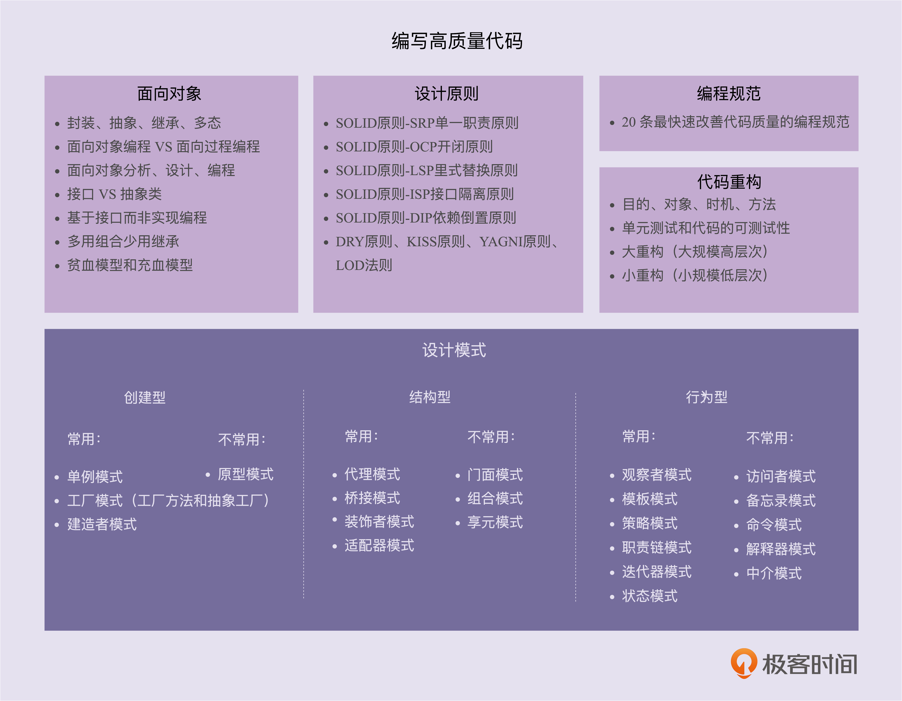

## 代码开发总纲

编写高质量可以划分为五个部分:面向对象、设计原则、编码规范、重构技巧、设计模式

概述:

1. 编程范式:包括面向对象,面向过程,面向函数三类,它是语言进行功能实现最基础的设计原则,编程是基于它进行功能实现,相当于语文的总纲.    
2. 设计原则:代码设计的经验总结,对于特定场景下的设计模式应用进行指导和应用标准.比如:开闭原则是策略,模板等模式的指导原则.    
3. 设计模式:是特定场景的可落地的解决方案和设计思路.目的是提高代码的扩展性.设计原则更抽象,而设计模式则更具体,可执行
4. 编程规范:解决可读性问题.比设计原则,设计模式更具体.持续重构的理论基础主要是编程规范.
5. 重构:利用上面标准和指导,进行代码优化,来保证代码在不断的业务功能增加中,满足编程范式,设计原则的要求.

代码优劣的评判标准:

1. 可读性.最基本的标准.遵守编码规范,命名,注释,函数行数,模块划分,高内聚.    
2. 简洁性.实现简洁,能抽取出核心业务规则并进行简化.
3. 可复用性.相同规则进行重用,避免代码重复.
4. 可扩展性.可以不修改或少修改原有代码,采用扩展的方式添加新功能.    
5. 灵活性.包括了扩展性,易用性和复用性.通过简单的方式就能实现新功能
6. 可测试性.能从侧面快速,准确的验证代码质量和功能;比较直接的就是单元测试是否容易编写,且可以覆盖一定功能比例.
7. 可维护性.在不破坏原有代码设计,不引入bug的情况下,快速修改或添加新功能代码.它其实是最高要求,包含了上面的所有标准.

### 面向对象    

- 面向对象,面向过程,面向函数

面对对象:以类或对象作为组织代码的基本单元的编程范式.数据(成员变量,属性)与方法一起实现.    
面向过程:以过程(函数,方法,操作)作为组织代码的基本单元的编程范式.数据(成员变量,属性)与方法分离实现.    
面向函数:以数学函数作为组织代码的基本单元的编程范式.与面向过程有点类似,但是它侧重于用数学公式来表示业务逻辑,方法定义更为抽象.

- 编程范式的区别

面对对象:便于人理解,是以现实世界为模型进行建模实现;通过复杂的结构,来模拟现实业务;本身的条理性就是为了支持复杂业务的开发    
面向过程:便于机器理解,以顺序执行为特点;不需要复杂的结构,通过方法来区分不同的操作;无法支持太复杂的业务;    
面向函数:简化代码,代码实现更为精简,但是不利于人理解,实现也比较复杂;同时应用场景也有限制.目前还在推广中.    

- 面对对象编程的特性:封装,继承,多态,抽象

封装:信息隐藏和数据访问保护.提高易用性,可维护性(访问权限控制)    
继承:通过从属关系,来提高代码复用性    
多态:父类声明,子类在运行时进行实现.提高扩展性和复用性.    
抽象:隐藏具体实现,简化调用方使用.提高扩展性和易用性.    

- 设计思想:

基于抽象而非实现:注重灵活性,扩展性,可维护性    
多用组合少用继承:降低耦合;提高可读性;   

抽象类与接口的价值:

抽象类:is a;主要是复用;    
接口:has a;实现与声明分离,主要是提高扩展性和易用性.

继承的问题:

继承层级不容易控制,代码的堆积会使实现日益复杂;    
不支持多继承;唯一性和执行顺序无法判断;

- 开发流程:分析,设计,编程

分析:搞清楚做什么    
设计:搞清楚怎么做    
编程:将分析和设计翻译成代码

需求分析方法:    

    1 搞清楚实际的问题痛点,这个较深入的了解业务才能发掘    
    2 了解业务方式,最直接的方式就是跟别人聊天沟通;查看文档;查看代码;参考其他公司现有实现    
    3 考虑非业务功能:核心是通用性和可读性
    4 实际的需求分析如果是新产品,一般会经过多次沟通,不断的细化功能,获取最根本的需求

- 设计四环节:

    划分职责并识别出类    
    定义类及属性,方法    
    定义类之间的交互关系    
    组装类并提供执行入口    

设计环节就是开发的基于需求的实现环节,核心是将细化的需求进行分类整理后,形成一个有体系的结构,支持需求功能,并便于理解(可读性),且有一定的扩展性(通用性)

分类方式(类识别):

    1 将需求按生命周期进行罗列    
    2 将生命周期中的步骤进行分类,识别出可以归为一体的步骤进行封装    
    3 基于封装的类识别出应具备的属性和方法    
    4 对这些类进行通用性扩展,抽象接口,并赋以合适的名称(可读性)

类与类的交互关系:

    泛化:继承,有所属关系    
    实现:接口与子接口    
    聚合:包含关系,生命周期可以不相互依赖
    组合:包含关系,一个类负责另一个类的生命周期管理    
    关联:包含聚合,组合;只要成员变量包含另一个类就是关联    
    依赖:包含关联.只有有其他类的引用就是依赖.包括了成员变量,方法参数,返回值等;

### 设计原则

### 编码规范

### 重构技巧

### 设计模式

