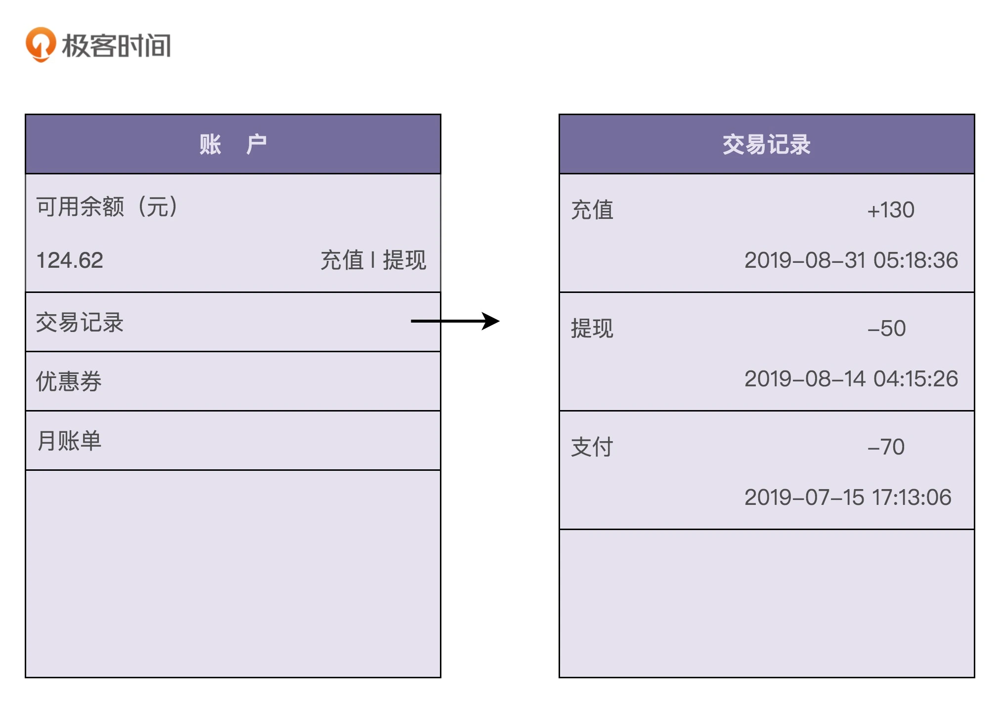
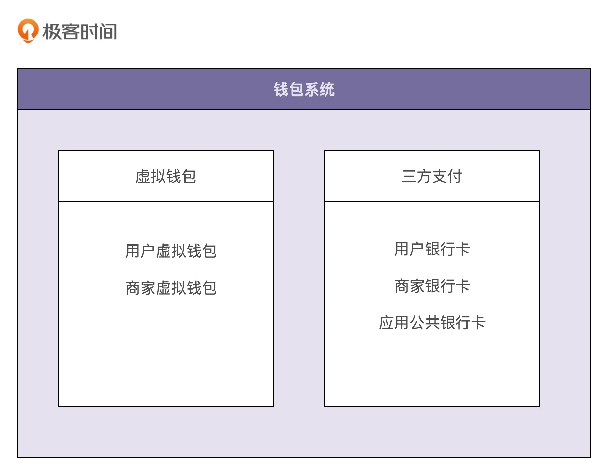
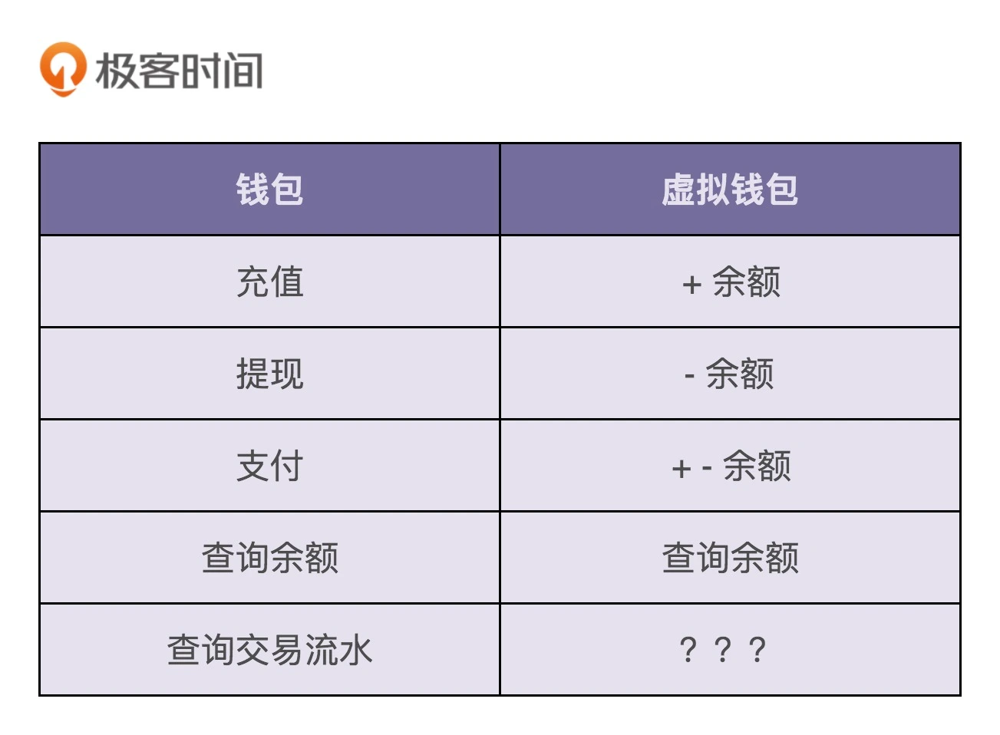

## 虚拟钱包系统与充血,贫血模型

### 钱包业务背景介绍

很多具有支付、购买功能的应用（比如淘宝、滴滴出行、极客时间等）都支持钱包的功能。应用为每个用户开设一个系统内的虚拟钱包账户，支持用户充值、提现、支付、冻结、透支、转赠、查询账户余额、查询交易流水等操作。下图是一张典型的钱包功能界面，你可以直观地感受一下。



一般来讲，每个虚拟钱包账户都会对应用户的一个真实的支付账户，有可能是银行卡账户，也有可能是三方支付账户（比如支付宝、微信钱包）。为了方便后续的讲解，我们限定钱包暂时只支持充值、提现、支付、查询余额、查询交易流水这五个核心的功能，其他比如冻结、透支、转赠等不常用的功能，我们暂不考虑。为了让你理解这五个核心功能是如何工作的，接下来，我们来一块儿看下它们的业务实现流程。

### 充值

用户通过三方支付渠道，把自己银行卡账户内的钱，充值到虚拟钱包账号中。这整个过程，我们可以分解为三个主要的操作流程：第一个操作是从用户的银行卡账户转账到应用的公共银行卡账户；第二个操作是将用户的充值金额加到虚拟钱包余额上；第三个操作是记录刚刚这笔交易流水。

### 支付

用户用钱包内的余额，支付购买应用内的商品。实际上，支付的过程就是一个转账的过程，从用户的虚拟钱包账户划钱到商家的虚拟钱包账户上。除此之外，我们也需要记录这笔支付的交易流水信息。

### 提现

除了充值、支付之外，用户还可以将虚拟钱包中的余额，提现到自己的银行卡中。这个过程实际上就是扣减用户虚拟钱包中的余额，并且触发真正的银行转账操作，从应用的公共银行账户转钱到用户的银行账户。同样，我们也需要记录这笔提现的交易流水信息。

### 查询余额

查询余额功能比较简单，我们看一下虚拟钱包中的余额数字即可。

### 查询交易流水

查询交易流水也比较简单。我们只支持三种类型的交易流水：充值、支付、提现。在用户充值、支付、提现的时候，我们会记录相应的交易信息。在需要查询的时候，我们只需要将之前记录的交易流水，按照时间、类型等条件过滤之后，显示出来即可。


## 钱包系统的设计思路

根据刚刚讲的业务实现流程和数据流转图，我们可以把整个钱包系统的业务划分为两部分，其中一部分单纯跟应用内的虚拟钱包账户打交道，另一部分单纯跟银行账户打交道。我们基于这样一个业务划分，给系统解耦，将整个钱包系统拆分为两个子系统：虚拟钱包系统和三方支付系统




现在我们来看下，如果要支持钱包的这五个核心功能，虚拟钱包系统需要对应实现哪些操作。我画了一张图，列出了这五个功能都会对应虚拟钱包的哪些操作。注意，交易流水的记录和查询，我暂时在图中打了个问号，那是因为这块比较特殊，我们待会再讲。



从图中我们可以看出，虚拟钱包系统要支持的操作非常简单，就是余额的加加减减。其中，充值、提现、查询余额三个功能，只涉及一个账户余额的加减操作，而支付功能涉及两个账户的余额加减操作：一个账户减余额，另一个账户加余额。现在，我们再来看一下图中问号的那部分，也就是交易流水该如何记录和查询？我们先来看一下，交易流水都需要包含哪些信息。我觉得下面这几个信息是必须包含的。


从图中我们可以发现，交易流水的数据格式包含两个钱包账号，一个是入账钱包账号，一个是出账钱包账号。为什么要有两个账号信息呢？这主要是为了兼容支付这种涉及两个账户的交易类型。不过，对于充值、提现这两种交易类型来说，我们只需要记录一个钱包账户信息就够了。

整个虚拟钱包的设计思路到此讲完了。接下来，我们来看一下，如何分别用基于贫血模型的传统开发模式和基于充血模型的 DDD 开发模式，来实现这样一个虚拟钱包系统？

### 基于贫血模型的传统开发模式

实际上，如果你有一定 Web 项目的开发经验，并且听明白了我刚刚讲的设计思路，那对你来说，利用基于贫血模型的传统开发模式来实现这样一个系统，应该是一件挺简单的事情。不过，为了对比两种开发模式，我还是带你一块儿来实现一遍。

这是一个典型的 Web 后端项目的三层结构。其中，Controller 和 VO 负责暴露接口，具体的代码实现如下所示。注意，Controller 中，接口实现比较简单，主要就是调用 Service 的方法，所以，我省略了具体的代码实现。

```

public class VirtualWalletController {
  // 通过构造函数或者IOC框架注入
  private VirtualWalletService virtualWalletService;
  
  public BigDecimal getBalance(Long walletId) { ... } //查询余额
  public void debit(Long walletId, BigDecimal amount) { ... } //出账
  public void credit(Long walletId, BigDecimal amount) { ... } //入账
  public void transfer(Long fromWalletId, Long toWalletId, BigDecimal amount) { ...} //转账
  //省略查询transaction的接口
}
```

Service 和 BO 负责核心业务逻辑，Repository 和 Entity 负责数据存取。Repository 这一层的代码实现比较简单，不是我们讲解的重点，所以我也省略掉了。Service 层的代码如下所示。注意，这里我省略了一些不重要的校验代码，比如，对 amount 是否小于 0、钱包是否存在的校验等等。

```

public class VirtualWalletBo {//省略getter/setter/constructor方法
  private Long id;
  private Long createTime;
  private BigDecimal balance;
}

public Enum TransactionType {
  DEBIT,
  CREDIT,
  TRANSFER;
}

public class VirtualWalletService {
  // 通过构造函数或者IOC框架注入
  private VirtualWalletRepository walletRepo;
  private VirtualWalletTransactionRepository transactionRepo;
  
  public VirtualWalletBo getVirtualWallet(Long walletId) {
    VirtualWalletEntity walletEntity = walletRepo.getWalletEntity(walletId);
    VirtualWalletBo walletBo = convert(walletEntity);
    return walletBo;
  }
  
  public BigDecimal getBalance(Long walletId) {
    return walletRepo.getBalance(walletId);
  }

  @Transactional
  public void debit(Long walletId, BigDecimal amount) {
    VirtualWalletEntity walletEntity = walletRepo.getWalletEntity(walletId);
    BigDecimal balance = walletEntity.getBalance();
    if (balance.compareTo(amount) < 0) {
      throw new NoSufficientBalanceException(...);
    }
    VirtualWalletTransactionEntity transactionEntity = new VirtualWalletTransactionEntity();
    transactionEntity.setAmount(amount);
    transactionEntity.setCreateTime(System.currentTimeMillis());
    transactionEntity.setType(TransactionType.DEBIT);
    transactionEntity.setFromWalletId(walletId);
    transactionRepo.saveTransaction(transactionEntity);
    walletRepo.updateBalance(walletId, balance.subtract(amount));
  }

  @Transactional
  public void credit(Long walletId, BigDecimal amount) {
    VirtualWalletTransactionEntity transactionEntity = new VirtualWalletTransactionEntity();
    transactionEntity.setAmount(amount);
    transactionEntity.setCreateTime(System.currentTimeMillis());
    transactionEntity.setType(TransactionType.CREDIT);
    transactionEntity.setFromWalletId(walletId);
    transactionRepo.saveTransaction(transactionEntity);
    VirtualWalletEntity walletEntity = walletRepo.getWalletEntity(walletId);
    BigDecimal balance = walletEntity.getBalance();
    walletRepo.updateBalance(walletId, balance.add(amount));
  }

  @Transactional
  public void transfer(Long fromWalletId, Long toWalletId, BigDecimal amount) {
    VirtualWalletTransactionEntity transactionEntity = new VirtualWalletTransactionEntity();
    transactionEntity.setAmount(amount);
    transactionEntity.setCreateTime(System.currentTimeMillis());
    transactionEntity.setType(TransactionType.TRANSFER);
    transactionEntity.setFromWalletId(fromWalletId);
    transactionEntity.setToWalletId(toWalletId);
    transactionRepo.saveTransaction(transactionEntity);
    debit(fromWalletId, amount);
    credit(toWalletId, amount);
  }
}
```

### 基于充血模型的 DDD 开发模式

刚刚讲了如何利用基于贫血模型的传统开发模式来实现虚拟钱包系统，现在，我们再来看一下，如何利用基于充血模型的 DDD 开发模式来实现这个系统？

在上一节课中，我们讲到，基于充血模型的 DDD 开发模式，跟基于贫血模型的传统开发模式的主要区别就在 Service 层，Controller 层和 Repository 层的代码基本上相同。所以，我们重点看一下，Service 层按照基于充血模型的 DDD 开发模式该如何来实现。

在这种开发模式下，我们把虚拟钱包 VirtualWallet 类设计成一个充血的 Domain 领域模型，并且将原来在 Service 类中的部分业务逻辑移动到 VirtualWallet 类中，让 Service 类的实现依赖 VirtualWallet 类。具体的代码实现如下所示：

```

public class VirtualWallet { // Domain领域模型(充血模型)
  private Long id;
  private Long createTime = System.currentTimeMillis();;
  private BigDecimal balance = BigDecimal.ZERO;
  
  public VirtualWallet(Long preAllocatedId) {
    this.id = preAllocatedId;
  }
  
  public BigDecimal balance() {
    return this.balance;
  }
  
  public void debit(BigDecimal amount) {
    if (this.balance.compareTo(amount) < 0) {
      throw new InsufficientBalanceException(...);
    }
    this.balance = this.balance.subtract(amount);
  }
  
  public void credit(BigDecimal amount) {
    if (amount.compareTo(BigDecimal.ZERO) < 0) {
      throw new InvalidAmountException(...);
    }
    this.balance = this.balance.add(amount);
  }
}

public class VirtualWalletService {
  // 通过构造函数或者IOC框架注入
  private VirtualWalletRepository walletRepo;
  private VirtualWalletTransactionRepository transactionRepo;
  
  public VirtualWallet getVirtualWallet(Long walletId) {
    VirtualWalletEntity walletEntity = walletRepo.getWalletEntity(walletId);
    VirtualWallet wallet = convert(walletEntity);
    return wallet;
  }
  
  public BigDecimal getBalance(Long walletId) {
    return walletRepo.getBalance(walletId);
  }
  
  @Transactional
  public void debit(Long walletId, BigDecimal amount) {
    VirtualWalletEntity walletEntity = walletRepo.getWalletEntity(walletId);
    VirtualWallet wallet = convert(walletEntity);
    wallet.debit(amount);
    VirtualWalletTransactionEntity transactionEntity = new VirtualWalletTransactionEntity();
    transactionEntity.setAmount(amount);
    transactionEntity.setCreateTime(System.currentTimeMillis());
    transactionEntity.setType(TransactionType.DEBIT);
    transactionEntity.setFromWalletId(walletId);
    transactionRepo.saveTransaction(transactionEntity);
    walletRepo.updateBalance(walletId, wallet.balance());
  }
  
  @Transactional
  public void credit(Long walletId, BigDecimal amount) {
    VirtualWalletEntity walletEntity = walletRepo.getWalletEntity(walletId);
    VirtualWallet wallet = convert(walletEntity);
    wallet.credit(amount);
    VirtualWalletTransactionEntity transactionEntity = new VirtualWalletTransactionEntity();
    transactionEntity.setAmount(amount);
    transactionEntity.setCreateTime(System.currentTimeMillis());
    transactionEntity.setType(TransactionType.CREDIT);
    transactionEntity.setFromWalletId(walletId);
    transactionRepo.saveTransaction(transactionEntity);
    walletRepo.updateBalance(walletId, wallet.balance());
  }

  @Transactional
  public void transfer(Long fromWalletId, Long toWalletId, BigDecimal amount) {
    //...跟基于贫血模型的传统开发模式的代码一样...
  }
}

```

看了上面的代码，你可能会说，领域模型 VirtualWallet 类很单薄，包含的业务逻辑很简单。相对于原来的贫血模型的设计思路，这种充血模型的设计思路，貌似并没有太大优势。你说得没错！这也是大部分业务系统都使用基于贫血模型开发的原因。不过，如果虚拟钱包系统需要支持更复杂的业务逻辑，那充血模型的优势就显现出来了。比如，我们要支持透支一定额度和冻结部分余额的功能。这个时候，我们重新来看一下 VirtualWallet 类的实现代码。


```

public class VirtualWallet {
  private Long id;
  private Long createTime = System.currentTimeMillis();;
  private BigDecimal balance = BigDecimal.ZERO;
  private boolean isAllowedOverdraft = true;
  private BigDecimal overdraftAmount = BigDecimal.ZERO;
  private BigDecimal frozenAmount = BigDecimal.ZERO;
  
  public VirtualWallet(Long preAllocatedId) {
    this.id = preAllocatedId;
  }
  
  public void freeze(BigDecimal amount) { ... }
  public void unfreeze(BigDecimal amount) { ...}
  public void increaseOverdraftAmount(BigDecimal amount) { ... }
  public void decreaseOverdraftAmount(BigDecimal amount) { ... }
  public void closeOverdraft() { ... }
  public void openOverdraft() { ... }
  
  public BigDecimal balance() {
    return this.balance;
  }
  
  public BigDecimal getAvaliableBalance() {
    BigDecimal totalAvaliableBalance = this.balance.subtract(this.frozenAmount);
    if (isAllowedOverdraft) {
      totalAvaliableBalance += this.overdraftAmount;
    }
    return totalAvaliableBalance;
  }
  
  public void debit(BigDecimal amount) {
    BigDecimal totalAvaliableBalance = getAvaliableBalance();
    if (totoalAvaliableBalance.compareTo(amount) < 0) {
      throw new InsufficientBalanceException(...);
    }
    this.balance = this.balance.subtract(amount);
  }
  
  public void credit(BigDecimal amount) {
    if (amount.compareTo(BigDecimal.ZERO) < 0) {
      throw new InvalidAmountException(...);
    }
    this.balance = this.balance.add(amount);
  }
}

```

领域模型 VirtualWallet 类添加了简单的冻结和透支逻辑之后，功能看起来就丰富了很多，代码也没那么单薄了。如果功能继续演进，我们可以增加更加细化的冻结策略、透支策略、支持钱包账号（VirtualWallet id 字段）自动生成的逻辑（不是通过构造函数经外部传入 ID，而是通过分布式 ID 生成算法来自动生成 ID）等等。VirtualWallet 类的业务逻辑会变得越来越复杂，也就很值得设计成充血模型了。


**第一个要讨论的问题是：在基于充血模型的 DDD 开发模式中，将业务逻辑移动到 Domain 中，Service 类变得很薄，但在我们的代码设计与实现中，并没有完全将 Service 类去掉，这是为什么？或者说，Service 类在这种情况下担当的职责是什么？哪些功能逻辑会放到 Service 类中？**

区别于 Domain 的职责，Service 类主要有下面这样几个职责。

1. Service 类负责与 Repository 交流。在我的设计与代码实现中，VirtualWalletService 类负责与 Repository 层打交道，调用 Respository 类的方法，获取数据库中的数据，转化成领域模型 VirtualWallet，然后由领域模型 VirtualWallet 来完成业务逻辑，最后调用 Repository 类的方法，将数据存回数据库。这里我再稍微解释一下，之所以让 VirtualWalletService 类与 Repository 打交道，而不是让领域模型 VirtualWallet 与 Repository 打交道，那是因为我们想保持领域模型的独立性，不与任何其他层的代码（Repository 层的代码）或开发框架（比如 Spring、MyBatis）耦合在一起，将流程性的代码逻辑（比如从 DB 中取数据、映射数据）与领域模型的业务逻辑解耦，让领域模型更加可复用。
2. Service 类负责跨领域模型的业务聚合功能。VirtualWalletService 类中的 transfer() 转账函数会涉及两个钱包的操作，因此这部分业务逻辑无法放到 VirtualWallet 类中，所以，我们暂且把转账业务放到 VirtualWalletService 类中了。当然，虽然功能演进，使得转账业务变得复杂起来之后，我们也可以将转账业务抽取出来，设计成一个独立的领域模型。
3. Service 类负责一些非功能性及与三方系统交互的工作。比如幂等、事务、发邮件、发消息、记录日志、调用其他系统的 RPC 接口等，都可以放到 Service 类中。


** 第二个要讨论问题是：在基于充血模型的 DDD 开发模式中，尽管 Service 层被改造成了充血模型，但是 Controller 层和 Repository 层还是贫血模型，是否有必要也进行充血领域建模呢？**

答案是没有必要。Controller 层主要负责接口的暴露，Repository 层主要负责与数据库打交道，这两层包含的业务逻辑并不多，前面我们也提到了，如果业务逻辑比较简单，就没必要做充血建模，即便设计成充血模型，类也非常单薄，看起来也很奇怪。

尽管这样的设计是一种面向过程的编程风格，但我们只要控制好面向过程编程风格的副作用，照样可以开发出优秀的软件。那这里的副作用怎么控制呢？

就拿 Repository 的 Entity 来说，即便它被设计成贫血模型，违反面向对象编程的封装特性，有被任意代码修改数据的风险，但 Entity 的生命周期是有限的。一般来讲，我们把它传递到 Service 层之后，就会转化成 BO 或者 Domain 来继续后面的业务逻辑。Entity 的生命周期到此就结束了，所以也并不会被到处任意修改。

我们再来说说 Controller 层的 VO。实际上 VO 是一种 DTO（Data Transfer Object，数据传输对象）。它主要是作为接口的数据传输承载体，将数据发送给其他系统。从功能上来讲，它理应不包含业务逻辑、只包含数据。所以，我们将它设计成贫血模型也是比较合理的。


