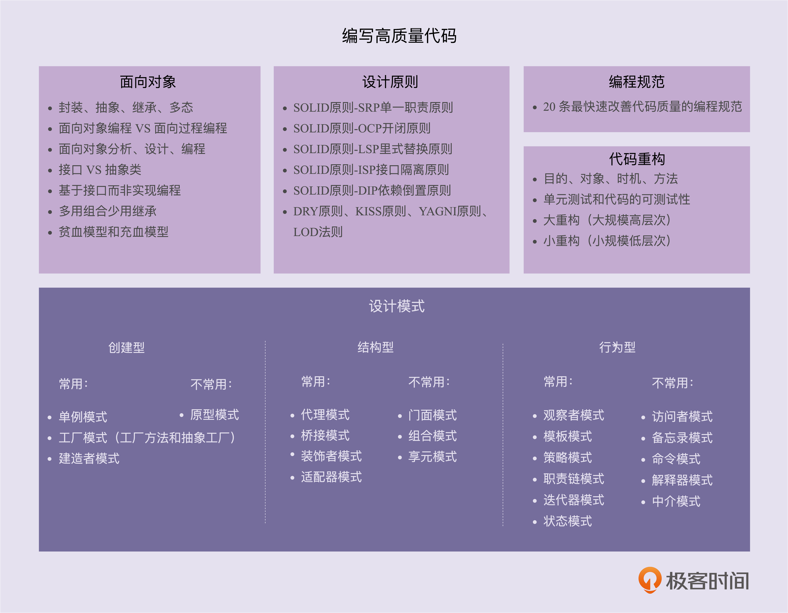
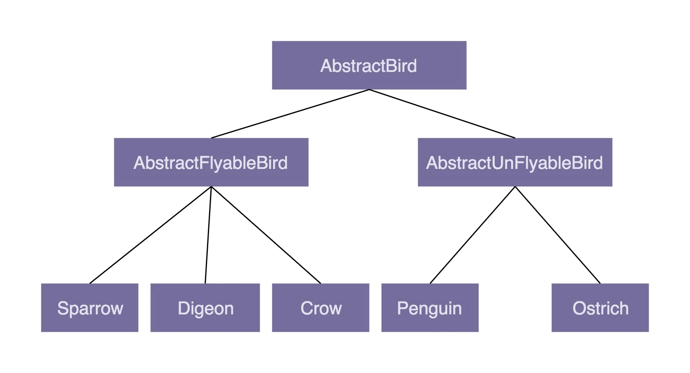

## 设计模式

是什么
为什么
怎么用

### 代码的评判标准

易维护、易读、易扩展、灵活、简洁、可复用、可测试

1. 可维护性（maintainability）

在不破坏原有代码设计、不引入新的 bug 的情况下，能够快速地修改或者添加代码;

代码的可读性好、简洁、可扩展性好，就会使得代码易维护；相反，就会使得代码不易维护。更细化地讲，如果代码分层清晰、模块化好、高内聚低耦合、遵从基于接口而非实现编程的设计原则等等，那就可能意味着代码易维护。除此之外，代码的易维护性还跟项目代码量的多少、业务的复杂程度、利用到的技术的复杂程度、文档是否全面、团队成员的开发水平等诸多因素有关。

2. 可读性（readability）

我们需要看代码是否符合编码规范、命名是否达意、注释是否详尽、函数是否长短合适、模块划分是否清晰、是否符合高内聚低耦合等等。你应该也能感觉到，从正面上，我们很难给出一个覆盖所有评价指标的列表。这也是我们无法量化可读性的原因。

3. 可扩展性（extensibility）

在不修改或少量修改原有代码的情况下，通过扩展的方式添加新的功能代码

4. 灵活性（flexibility）

当我们添加一个新的功能代码的时候，原有的代码已经预留好了扩展点，**我们不需要修改原有的代码，只要在扩展点上添加新的代码即可**。这个时候，我们除了可以说代码易扩展，还可以说代码写得好灵活。    
当我们要实现一个功能的时候，发现原有代码中，**已经抽象出了很多底层可以复用的模块、类等代码，我们可以拿来直接使用**。这个时候，我们除了可以说代码易复用之外，还可以说代码写得好灵活。    
当我们使用某组接口的时候，**如果这组接口可以应对各种使用场景，满足各种不同的需求**，我们除了可以说接口易用之外，还可以说这个接口设计得好灵活或者代码写得好灵活。

5. 简洁性（simplicity）

思从深而行从简，真正的高手能云淡风轻地用最简单的方法解决最复杂的问题。这也是一个编程老手跟编程新手的本质区别之一。

6. 可复用性（reusability）

尽量减少重复代码的编写，复用已有的代码

7. 可测试性（testability）

代码可测试性的好坏，能从侧面上非常准确地反应代码质量的好坏。代码的可测试性差，比较难写单元测试，那基本上就能说明代码设计得有问题。

### 概述

1. 面向对象编程因为其具有丰富的特性（封装、抽象、继承、多态），可以实现很多复杂的设计思路，是很多设计原则、设计模式等编码实现的基础。    
2. 设计原则是指导我们代码设计的一些经验总结，对于某些场景下，是否应该应用某种设计模式，具有指导意义。比如，“开闭原则”是很多设计模式（策略、模板等）的指导原则。
3. 设计模式是针对软件开发中经常遇到的一些设计问题，总结出来的一套解决方案或者设计思路。应用设计模式的主要目的是提高代码的可扩展性。从抽象程度上来讲，设计原则比设计模式更抽象。设计模式更加具体、更加可执行。
4. 编程规范主要解决的是代码的可读性问题。编码规范相对于设计原则、设计模式，更加具体、更加偏重代码细节、更加能落地。持续的小重构依赖的理论基础主要就是编程规范。
5. 重构作为保持代码质量不下降的有效手段，利用的就是面向对象、设计原则、设计模式、编码规范这些理论。




### 面向对象

面向对象编程:    

```
面向对象编程是一种编程范式或编程风格。它以类或对象作为组织代码的基本单元，并将封装、抽象、继承、多态四个特性，作为代码设计和实现的基石 。    
面向对象编程语言是支持类或对象的语法机制，并有现成的语法机制，能方便地实现面向对象编程四大特性（封装、抽象、继承、多态）的编程语言。
```

面向对象编程语言:是支持类或对象的语法机制，并有现成的语法机制，能方便地实现面向对象编程四大特性（封装、抽象、继承、多态）的编程语言。

如何判断语言是否是面向对象语言?

只要某种编程语言支持类或对象的语法概念，并且以此作为组织代码的基本单元，那就可以被粗略地认为它就是面向对象编程语言了

- 面向对象编程开发流程:

面向对象分析（OOA Object Oriented Analysis）:搞清楚做什么    
面向对象设计（OOD Object Oriented Design）:搞清楚怎么做    
面向对象编程（OOP）:将分析和设计的的结果翻译成代码的过程    
OOA、OOD、OOP 三个连在一起就是面向对象分析、设计、编程（实现），正好是面向对象软件开发要经历的三个阶段。

#### 面向对象编程特性

1. 关于封装特性    

封装也叫作信息隐藏或者数据访问保护。类通过暴露有限的访问接口，授权外部仅能通过类提供的方式来访问内部信息或者数据。它需要编程语言提供**权限访问控制**语法来支持，例如 Java 中的 private、protected、public 关键字。
封装特性存在的意义，一方面是保护数据不被随意修改，提高代码的可维护性；
另一方面是仅暴露有限的必要接口，提高类的易用性。

2. 关于抽象特性    

封装主要讲如何隐藏信息、保护数据，那抽象就是讲如何隐藏方法的具体实现，让使用者只需要关心方法提供了哪些功能，不需要知道这些功能是如何实现的。抽象可以通过接口类或者抽象类来实现，但也并不需要特殊的语法机制来支持。
抽象存在的意义，一方面是提高代码的可扩展性、维护性，修改实现不需要改变定义，减少代码的改动范围；
另一方面，它也是处理复杂系统的有效手段，能有效地过滤掉不必要关注的信息。

3. 关于继承特性    

继承是用来表示类之间的 is-a 关系，分为两种模式：单继承和多继承。单继承表示一个子类只继承一个父类，多继承表示一个子类可以继承多个父类。为了实现继承这个特性，编程语言需要提供特殊的语法机制来支持。
继承主要是用来解决代码复用的问题。

4. 关于多态特性    

多态是指子类可以替换父类，在实际的代码运行过程中，调用子类的方法实现。多态这种特性也需要编程语言提供特殊的语法机制来实现，比如继承、接口类、duck-typing。
多态可以提高代码的扩展性和复用性，是很多设计模式、设计原则、编程技巧的代码实现基础。

### 面向对象与面向过程区别

编程范式现在有多种:

面向过程:易于机器实现(已淘汰)    
面向对象:易于人理解和开发,维护(主流)    
函数式编程:让写代码更加简单些，封装了很多设计模式、并发处理(推广中go)

面向对象是以人的角度,通过抽象显示模型来在计算机中模拟现实事物关系.而面向过程是以机器的角度,顺序性的定义现实事物流程.都运用了抽象现实模型.但是具体实现方式不同.

面向对象概念:

面向对象编程是一种编程范式或编程风格。它以类或对象作为组织代码的基本单元，并将封装、抽象、继承、多态四个特性，作为代码设计和实现的基石 。    
面向对象编程语言是支持类或对象的语法机制，并有现成的语法机制，能方便地实现面向对象编程四大特性（封装、抽象、继承、多态）的编程语言。

面向过程编程概念:

面向过程编程也是一种编程范式或编程风格。它以过程（可以理解为方法、函数、操作）作为组织代码的基本单元，以数据（可以理解为成员变量、属性）与方法相分离为最主要的特点。    
面向过程风格是一种流程化的编程风格，通过拼接一组顺序执行的方法来操作数据完成一项功能。    
面向过程编程语言首先是一种编程语言。它最大的特点是不支持类和对象两个语法概念，不支持丰富的面向对象编程特性（比如继承、多态、封装），仅支持面向过程编程。

面向函数编程:

以数学公式(函数)作为组织代码的基本单元的编程范式.与面向过程有点类似,但是它侧重于用数学公式来表示业务逻辑,方法定义更为抽象.

区别:

对于计算机来讲不区分面向对象还是面向过程,核心是获取执行数据的顺序和逻辑关系.面向过程更适合计算机的执行机制.但是从开发和维护角度,在复杂业务逻辑中人更易于接受面向对象的方式.因为它更接近现实世界,更易于实现和维护.

面向过程实现:

```

struct User {
  char name[64];
  int age;
  char gender[16];
};

struct User parse_to_user(char* text) {
  // 将text(“小王&28&男”)解析成结构体struct User
}

char* format_to_text(struct User user) {
  // 将结构体struct User格式化成文本（"小王\t28\t男"）
}

void sort_users_by_age(struct User users[]) {
  // 按照年龄从小到大排序users
}

void format_user_file(char* origin_file_path, char* new_file_path) {
  // open files...
  struct User users[1024]; // 假设最大1024个用户
  int count = 0;
  while(1) { // read until the file is empty
    struct User user = parse_to_user(line);
    users[count++] = user;
  }
  
  sort_users_by_age(users);
  
  for (int i = 0; i < count; ++i) {
    char* formatted_user_text = format_to_text(users[i]);
    // write to new file...
  }
  // close files...
}

int main(char** args, int argv) {
  format_user_file("/home/zheng/user.txt", "/home/zheng/formatted_users.txt");
}
```

面向对象实现

```

 public class User {
  private String name;
  private int age;
  private String gender;
  
  public User(String name, int age, String gender) {
    this.name = name;
    this.age = age;
    this.gender = gender;
  }
  
  public static User praseFrom(String userInfoText) {
    // 将text(“小王&28&男”)解析成类User
  }
  
  public String formatToText() {
    // 将类User格式化成文本（"小王\t28\t男"）
  }
}

public class UserFileFormatter {
  public void format(String userFile, String formattedUserFile) {
    // Open files...
    List users = new ArrayList<>();
    while (1) { // read until file is empty 
      // read from file into userText...
      User user = User.parseFrom(userText);
      users.add(user);
    }
    // sort users by age...
    for (int i = 0; i < users.size(); ++i) {
      String formattedUserText = user.formatToText();
      // write to new file...
    }
    // close files...
  }
}

public class MainApplication {
  public static void main(String[] args) {
    UserFileFormatter userFileFormatter = new UserFileFormatter();
    userFileFormatter.format("/home/zheng/users.txt", "/home/zheng/formatted_users.txt");
  }
}
```

面向过程和面向对象最基本的区别就是，代码的组织方式不同。面向过程风格的代码被组织成了一组方法集合及其数据结构（struct User），方法和数据结构的定义是分开的。面向对象风格的代码被组织成一组类，方法和数据结构被绑定一起，定义在类中

- 面向对象的优势:

对于大规模复杂程序的开发，程序的处理流程并非单一的一条主线，而是错综复杂的网状结构。面向对象编程比起面向过程编程，更能应对这种复杂类型的程序开发。    
面向对象编程相比面向过程编程，具有更加丰富的特性（封装、抽象、继承、多态）。利用这些特性编写出来的代码，更加易扩展、易复用、易维护。    
从编程语言跟机器打交道的方式的演进规律中，我们可以总结出：面向对象编程语言比起面向过程编程语言，更加人性化、更加高级、更加智能。

### 面向对象中使用面向过程编程的行为

1. 滥用 getter、setter 方法:打破封装
2. Constants 类、Utils 类的设计问题:大而全的类.打破封装.内聚性和复用性不好
3. 基于贫血模型的开发模式: mvc.数据与方法分离.打破了封装.这里存疑.m,v,c都可以看成对象,并非完全的数据与方法分离.实际充血模型与现有框架不适配;

MVC这种框架模式本质上与面向对象并不冲突。当我们在讨论面向对象的时候，我们究竟应该怎样去定义一个对象，究竟什么才能被我们看成是对象，是不是只有像某种物体，比如说一只鸟或者一只狗我们才能去把他定义为对象？我认为，MVC里面的三个部分Model 、Controller 、View 我们都能把他们单独的看成一个对象，比如说Model，本来它是数据单元，但是如果我们把他看做一个对象的话，里面存储的数据不就是我们对象里的属性么，而对于数据的二次加工处理等等操作不就是对象里的方法么？同理，对于View而言，里面小的view组件或者是其他的view不就是我们对象里面的属性，而对于不同的view组件或其他view的组合或者其他的处理操作不就是对象里面的方法么？所以说，不必死抠定义，数据就一定要和业务逻辑组成一个类云云。。。我们最后写出来的代码的目的就是，1.要解决问题；2.代码有可扩展性，可读性；3，代码解耦；

1.用shell实现自动化脚本做的服务编排，一般都是面向过程，一步一步的。而k8s的编排却是面向对象的，因为它为这个顺序流抽象出了很多角色，将原本一步一步的顺序操作转变成了多个角色间的轮转和交互。

2.从接触ddd才走出javaer举面向对象旗，干面向过程勾当的局面。所谓为什么“充血模型”不流行，我认为不外呼两个。一，规范的领域模型对于底层基础架构来说并不友好（缺少setget），所以会导致规范的领域模型与现有基础架构不贴合，切很难开发出完全贴合的基础架构，进而引深出，合理的业务封装却阻碍关于复用通用抽象的矛盾。二，合理的业务封装，需要在战略上对业务先做合理的归类分割和抽象。而这个前置条件很少也不好达成。进而缺少前置设计封装出来的“充血模型”会有种四不像的味道，反而加剧了业务的复杂性，还不如“贫血模型”来得实用。事实上快节奏下，前置战略设计往往都是不足的，所以想构建优秀的“充血模型”架构，除了要对业务领域和领域设计有足够的认知，在重构手法和重构意愿上还要有一定讲究和追求，这样才能让项目以“充血模型”持续且良性的迭代。

3.“充血模型”相对于“贫血模型”有什么好处？从我的经验来看，可读性其实可能“贫血模型”还好一点，这也可能有思维惯性的原因在里面。但从灵活和扩展性来说“充血模型”会优秀很多，因为好的“充血模型”往往意味着边界清晰（耦合低），功能内敛（高内聚）。

### 接口和抽象类

1. 抽象类和接口的语法特性

抽象类:

不允许被实例化，只能被继承。    
它可以包含属性和方法。    
方法既可以包含代码实现，也可以不包含代码实现。不包含代码实现的方法叫作抽象方法。子类继承抽象类，必须实现抽象类中的所有抽象方法。    

接口:

接口是一组协议或约定

不能包含属性(只是不能包括成员变量,可以包含类变量)，    
只能声明方法，方法不能包含代码实现(1.8后可以增加default方法)。    
类实现接口的时候，必须实现接口中声明的所有方法。

2. 抽象类和接口存在的意义

抽象类是对成员变量和方法的抽象，是一种 is-a 关系，是为了解决代码复用问题。    
接口仅仅是对方法的抽象，是一种 has-a 关系，表示具有某一组行为特性，是为了解决解耦问题(解决抽象而非代码复用)，隔离接口和具体的实现，提高代码的扩展性。

3. 抽象类的价值

强制方法实现;不能实例化;

强制方法实现是抽象了方法个性行为的实现,便于使用多态来统一子类行为;而普通父类只能定义空方法实现此功能,不够优雅易懂;    
由于抽象方法的存在,所以不能实例化;避免方法调用异常;

#### 面向接口编程

1. “基于接口而非实现编程”，这条原则的另一个表述方式，是“基于抽象而非实现编程”。后者的表述方式其实更能体现这条原则的设计初衷。我们在做软件开发的时候，一定要有抽象意识、封装意识、接口意识。越抽象、越顶层、越脱离具体某一实现的设计，越能提高代码的灵活性、扩展性、可维护性。
2. 我们在定义接口的时候，一方面，命名要足够通用，不能包含跟具体实现相关的字眼；另一方面，与特定实现有关的方法不要定义在接口中。
3. “基于接口而非实现编程”这条原则，不仅仅可以指导非常细节的编程开发，还能指导更加上层的架构设计、系统设计等。比如，服务端与客户端之间的“接口”设计、类库的“接口”设计。

#### 继承与组合

1. 为什么不推荐使用继承？

继承是面向对象的四大特性之一，用来表示类之间的 is-a 关系，可以解决代码复用的问题。虽然继承有诸多作用，但继承层次过深、过复杂，也会影响到代码的可维护性。在这种情况下，我们应该尽量少用，甚至不用继承。

会飞不会飞
    

会飞不会飞会叫不会叫


2. 组合相比继承有哪些优势？

继承主要有三个作用：表示 is-a 关系，支持多态特性，代码复用。而这三个作用都可以通过组合、接口、委托三个技术手段来达成。除此之外，利用组合还能解决层次过深、过复杂的继承关系影响代码可维护性的问题。

```

public interface Flyable {
  void fly()；
}
public class FlyAbility implements Flyable {
  @Override
  public void fly() { //... }
}
//省略Tweetable/TweetAbility/EggLayable/EggLayAbility

public class Ostrich implements Tweetable, EggLayable {//鸵鸟
  private TweetAbility tweetAbility = new TweetAbility(); //组合
  private EggLayAbility eggLayAbility = new EggLayAbility(); //组合
  //... 省略其他属性和方法...
  @Override
  public void tweet() {
    tweetAbility.tweet(); // 委托
  }
  @Override
  public void layEgg() {
    eggLayAbility.layEgg(); // 委托
  }
}
```

声明与能力复用:

接口定义能力;组合注入外部能力;委托直接使用外部能力;

3. 如何判断该用组合还是继承？

尽管我们鼓励多用组合少用继承，但组合也并不是完美的，继承也并非一无是处。在实际的项目开发中，我们还是要根据具体的情况，来选择该用继承还是组合。如果类之间的继承结构稳定，层次比较浅，关系不复杂，我们就可以大胆地使用继承。反之，我们就尽量使用组合来替代继承。除此之外，还有一些设计模式、特殊的应用场景，会固定使用继承或者组合。

### 贫血模型与充血模型

贫血模型(Anemic Domain Model):业务逻辑与数据分割为两部分,破坏了面向对象的封装.如:拆分service层与BO值对象;

充血模型(Rich Domain Model):数据和对应的业务逻辑被封装到同一个类中,被DDD所倡导;

领域驱动设计，即 DDD，主要是用来指导如何解耦业务系统，划分业务模块，定义业务领域模型及其交互.

#### 充血与贫血模型的区别

在基于贫血模型的传统开发模式中，Service 层包含 Service 类和 BO 类两部分，BO 是贫血模型，只包含数据，不包含具体的业务逻辑。业务逻辑集中在 Service 类中。在基于充血模型的 DDD 开发模式中，Service 层包含 Service 类和 Domain 类两部分。Domain 就相当于贫血模型中的 BO。不过，Domain 与 BO 的区别在于它是基于充血模型开发的，既包含数据，也包含业务逻辑。而 Service 类变得非常单薄。
基于贫血模型的传统的开发模式，重 Service 轻 BO；基于充血模型的 DDD 开发模式，轻 Service 重 Domain。

- 贫血模型的价值

1 开发简单.简单业务操作直接面向SQL的CRUD.业务逻辑简单,不需要复杂的模型设计;    
2 充血模型需要抽象程度更高;前期就需要设计好针对数据要暴露那些操作;而贫血模型只需要定义好数据,具体操作可以等需要时在service中定义即可;    
3 转型成本.需要被大家所接受.

- 充血模型的价值

1 面向对象开发;易于复用.提前定义好可复用的领域模型.领域模型相当于业务中间层(数据与操作),所有的业务都基于领域模型进行开发.    
而贫血模型是面向数据库开发,无法实现功能复用;

#### 充血与贫血的适用范围

基于充血模型的 DDD 开发模式跟基于贫血模型的传统开发模式相比，主要区别在 Service 层。在基于充血模型的开发模式下，我们将部分原来在 Service 类中的业务逻辑移动到了一个充血的 Domain 领域模型中，让 Service 类的实现依赖这个 Domain 类。

在基于充血模型的 DDD 开发模式下，Service 类并不会完全移除，而是负责一些不适合放在 Domain 类中的功能。比如，负责与 Repository 层打交道、跨领域模型的业务聚合功能、幂等事务等非功能性的工作。

基于充血模型的 DDD 开发模式跟基于贫血模型的传统开发模式相比，Controller 层和 Repository 层的代码基本上相同。这是因为，Repository 层的 Entity 生命周期有限，Controller 层的 VO 只是单纯作为一种 DTO。两部分的业务逻辑都不会太复杂。业务逻辑主要集中在 Service 层。所以，Repository 层和 Controller 层继续沿用贫血模型的设计思路是没有问题的。

[虚拟钱包示例](虚拟钱包系统/虚拟钱包设计思路及充血贫血模型实现.md)


### 问题

1. Java为什么不支持多继承

多继承有多义性,提供了接口更完善的方法.

多重继承有副作用：钻石问题(菱形继承)。
假设类 B 和类 C 继承自类 A，且都重写了类 A 中的同一个方法，而类 D 同时继承了类 B 和类 C，那么此时类 D 会继承 B、C 的方法，那对于 B、C 重写的 A 中的方法，类 D 会继承哪一个呢？这里就会产生歧义。
考虑到这种二义性问题，Java 不支持多重继承。但是 Java 支持多接口实现，因为接口中的方法，是抽象的（从JDK1.8之后，接口中允许给出一些默认方法的实现，这里不考虑这个），就算一个类实现了多个接口，且这些接口中存在某个同名方法，但是我们在实现接口的时候，这个同名方法需要由我们这个实现类自己来实现，所以并不会出现二义性的问题。

多继承的多义性核心问题是解决多义的唯一性和执行顺序,只有在解决这两个问题后,才能实现多继承.

2. 为什么操作系统是面向过程语言实现的?

操作系统是业务无关的，它更接近于底层计算机，因此更适合用面向过程的语言编写。而接近业务的也就是接近人的软件，则更适合用面向对象的语言编写。    
面向过程语言出现较早,但是没有面向对象的语言选择.同时编程范式只是原则,不同语言可以相互借鉴设计思想.

3. 面向过程语言如何实现面向过程特性的.

c的指针可以实现多态;核心是利用语言特性模拟继承,多态;封装和抽象所有语言都可以支持;

4. 如何使用抽象类模拟接口;如何使用普通类模拟抽象类;

抽象类只定义抽象方法即可模拟接口;    
普通类定义私有构造函数,定义空实现方法,且该方法直接调用会抛出异常;即可实现抽象类;

