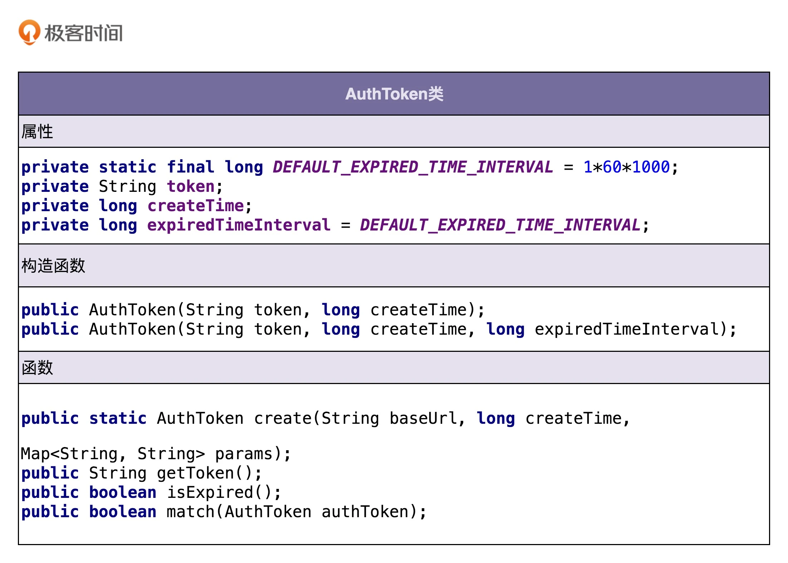
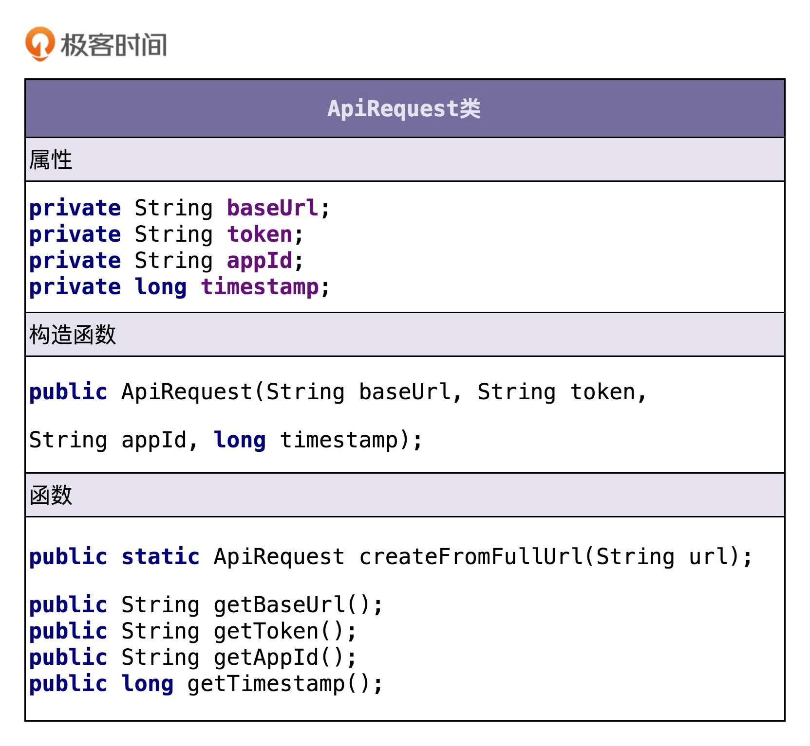

## 设计模式

### 需求分析 

如何做需求分析?    
如何做职责划分？    
需要定义哪些类？    
每个类应该具有哪些属性、方法？    
类与类之间该如何交互？    
如何组装类成一个可执行的程序？

需求:    
为了保证接口调用的安全性，我们希望设计实现一个接口调用鉴权功能，只有经过认证之后的系统才能调用我们的接口，没有认证过的系统调用我们的接口会被拒绝。我希望由你来负责这个任务的开发，争取尽快上线。

问题:    

1. 需求不明确;首先要做的都是将笼统的需求细化到足够清晰、可执行。我们需要通过沟通、挖掘、分析、假设、梳理，搞清楚具体的需求有哪些，哪些是现在要做的，哪些是未来可能要做的，哪些是不用考虑做的
2. 缺少锻炼;对工程师的需求分析能力、设计能力、编码能力，甚至逻辑思维能力的要求，都是比较高

需求分析:

尽管针对框架、组件、类库等非业务系统的开发，我们一定要有组件化意识、框架意识、抽象意识，开发出来的东西要足够通用，不能局限于单一的某个业务需求，但这并不代表我们就可以脱离具体的应用场景，闷头拍脑袋做需求分析。多跟业务团队聊聊天，甚至自己去参与几个业务系统的开发，只有这样，我们才能真正知道业务系统的痛点，才能分析出最有价值的需求。不过，针对鉴权这一功能的开发，最大的需求方还是我们自己，所以，我们也可以先从满足我们自己系统的需求开始，然后再迭代优化。

分析流程:

1. 第一轮基础分析

对于如何做鉴权这样一个问题，最简单的解决方案就是，通过用户名加密码来做认证。我们给每个允许访问我们服务的调用方，派发一个应用名（或者叫应用 ID、AppID）和一个对应的密码（或者叫秘钥）。调用方每次进行接口请求的时候，都携带自己的 AppID 和密码。微服务在接收到接口调用请求之后，会解析出 AppID 和密码，跟存储在微服务端的 AppID 和密码进行比对。如果一致，说明认证成功，则允许接口调用请求；否则，就拒绝接口调用请求。

2. 第二轮分析优化

不过，这样的验证方式，每次都要明文传输密码。密码很容易被截获，是不安全的。那如果我们借助加密算法（比如 SHA），对密码进行加密之后，再传递到微服务端验证，是不是就可以了呢？实际上，这样也是不安全的，因为加密之后的密码及 AppID，照样可以被未认证系统（或者说黑客）截获，未认证系统可以携带这个加密之后的密码以及对应的 AppID，伪装成已认证系统来访问我们的接口。这就是典型的[“重放攻击”](https://zh.wikipedia.org/wiki/%E9%87%8D%E6%94%BE%E6%94%BB%E5%87%BB)。

提出问题，然后再解决问题，是一个非常好的迭代优化方法。对于刚刚这个问题，我们可以借助 OAuth 的验证思路来解决。调用方将请求接口的 URL 跟 AppID、密码拼接在一起，然后进行加密，生成一个 token。调用方在进行接口请求的的时候，将这个 token 及 AppID，随 URL 一块传递给微服务端。微服务端接收到这些数据之后，根据 AppID 从数据库中取出对应的密码，并通过同样的 token 生成算法，生成另外一个 token。用这个新生成的 token 跟调用方传递过来的 token 对比。如果一致，则允许接口调用请求；否则，就拒绝接口调用请求。

3. 第三轮分析优化

不过，这样的设计仍然存在重放攻击的风险，还是不够安全。每个 URL 拼接上 AppID、密码生成的 token 都是固定的。未认证系统截获 URL、token 和 AppID 之后，还是可以通过重放攻击的方式，伪装成认证系统，调用这个 URL 对应的接口。

为了解决这个问题，我们可以进一步优化 token 生成算法，引入一个随机变量，让每次接口请求生成的 token 都不一样。我们可以选择时间戳作为随机变量。原来的 token 是对 URL、AppID、密码三者进行加密生成的，现在我们将 URL、AppID、密码、时间戳四者进行加密来生成 token。调用方在进行接口请求的时候，将 token、AppID、时间戳，随 URL 一并传递给微服务端。

微服务端在收到这些数据之后，会验证当前时间戳跟传递过来的时间戳，是否在一定的时间窗口内（比如一分钟）。如果超过一分钟，则判定 token 过期，拒绝接口请求。如果没有超过一分钟，则说明 token 没有过期，就再通过同样的 token 生成算法，在服务端生成新的 token，与调用方传递过来的 token 比对，看是否一致。如果一致，则允许接口调用请求；否则，就拒绝接口调用请求。

4. 第四轮分析优化

不过，你可能会说，这样还是不够安全啊。未认证系统还是可以在这一分钟的 token 失效窗口内，通过截获请求、重放请求，来调用我们的接口啊！

你说得没错。不过，攻与防之间，本来就没有绝对的安全。我们能做的就是，尽量提高攻击的成本。这个方案虽然还有漏洞，但是实现起来足够简单，而且不会过度影响接口本身的性能（比如响应时间）。所以，权衡安全性、开发成本、对系统性能的影响，这个方案算是比较折中、比较合理的了。

实际上，还有一个细节我们没有考虑到，那就是，如何在微服务端存储每个授权调用方的 AppID 和密码。当然，这个问题并不难。最容易想到的方案就是存储到数据库里，比如 MySQL。不过，开发像鉴权这样的非业务功能，最好不要与具体的第三方系统有过度的耦合。

针对 AppID 和密码的存储，我们最好能灵活地支持各种不同的存储方式，比如 ZooKeeper、本地配置文件、自研配置中心、MySQL、Redis 等。我们不一定针对每种存储方式都去做代码实现，但起码要留有扩展点，保证系统有足够的灵活性和扩展性，能够在我们切换存储方式的时候，尽可能地减少代码的改动。

5. 最终确定需求

到此，需求已经足够细化和具体了。现在，我们按照鉴权的流程，对需求再重新描述一下。如果你熟悉 UML，也可以用时序图、流程图来描述。不过，用什么描述不是重点，描述清楚才是最重要的。考虑到在接下来的面向对象设计环节中，我会基于文字版本的需求描述，来进行类、属性、方法、交互等的设计，所以，这里我给出的最终需求描述是文字版本的。

    调用方进行接口请求的时候，将 URL、AppID、密码、时间戳拼接在一起，通过加密算法生成 token，并且将 token、AppID、时间戳拼接在 URL 中，一并发送到微服务端。    
    微服务端在接收到调用方的接口请求之后，从请求中拆解出 token、AppID、时间戳。    
    微服务端首先检查传递过来的时间戳跟当前时间，是否在 token 失效时间窗口内。如果已经超过失效时间，那就算接口调用鉴权失败，拒绝接口调用请求。    
    如果 token 验证没有过期失效，微服务端再从自己的存储中，取出 AppID 对应的密码，通过同样的 token 生成算法，生成另外一个 token，与调用方传递过来的 token 进行匹配；如果一致，则鉴权成功，允许接口调用，否则就拒绝接口调用。
    
这就是我们需求分析的整个思考过程，从最粗糙、最模糊的需求开始，通过“提出问题 - 解决问题”的方式，循序渐进地进行优化，最后得到一个足够清晰、可落地的需求描述。


### 需求实现

核心步骤:

    划分职责进而识别出有哪些类；    
    定义类及其属性和方法；    
    定义类与类之间的交互关系；    
    将类组装起来并提供执行入口。    

步骤讲解:

- 划分职责进而识别出有哪些类

那就是根据需求描述，把其中涉及的功能点，一个一个罗列出来，然后再去看哪些功能点职责相近，操作同样的属性，是否应该归为同一个类。我们来看一下，针对鉴权这个例子，具体该如何来做。

需求:

    调用方进行接口请求的时候，将 URL、AppID、密码、时间戳拼接在一起，通过加密算法生成 token，并且将 token、AppID、时间戳拼接在 URL 中，一并发送到微服务端。    
    微服务端在接收到调用方的接口请求之后，从请求中拆解出 token、AppID、时间戳。    
    微服务端首先检查传递过来的时间戳跟当前时间，是否在 token 失效时间窗口内。如果已经超过失效时间，那就算接口调用鉴权失败，拒绝接口调用请求。    
    如果 token 验证没有过期失效，微服务端再从自己的存储中，取出 AppID 对应的密码，通过同样的 token 生成算法，生成另外一个 token，与调用方传递过来的 token 进行匹配。如果一致，则鉴权成功，允许接口调用；否则就拒绝接口调用。

单一指责拆分需求为小功能点:

    把 URL、AppID、密码、时间戳拼接为一个字符串；    
    对字符串通过加密算法加密生成 token；    
    将 token、AppID、时间戳拼接到 URL 中，形成新的 URL；    
    解析 URL，得到 token、AppID、时间戳等信息；    
    从存储中取出 AppID 和对应的密码；    
    根据时间戳判断 token 是否过期失效；    
    验证两个 token 是否匹配；    
    
功能分类,划分功能模块,逐步细化抽取出业务模型

从上面的功能列表中，我们发现，1、2、6、7 都是跟 token 有关，负责 token 的生成、验证；3、4 都是在处理 URL，负责 URL 的拼接、解析；5 是操作 AppID 和密码，负责从存储中读取 AppID 和密码。所以，我们可以粗略地得到三个核心的类：AuthToken、Url、CredentialStorage。AuthToken 负责实现 1、2、6、7 这四个操作；Url 负责 3、4 两个操作；CredentialStorage 负责 5 这个操作。


- 定义类及其属性和方法

刚刚我们通过分析需求描述，识别出了三个核心的类，它们分别是 AuthToken、Url 和 CredentialStorage。现在我们来看下，每个类都有哪些属性和方法。我们还是从功能点列表中挖掘。

AuthToken 类相关的功能点有四个：

    把 URL、AppID、密码、时间戳拼接为一个字符串；    
    对字符串通过加密算法加密生成 token；    
    根据时间戳判断 token 是否过期失效；    
    验证两个 token 是否匹配。    

对于方法的识别，很多面向对象相关的书籍，一般都是这么讲的，识别出需求描述中的动词，作为候选的方法，再进一步过滤筛选。类比一下方法的识别，我们可以把功能点中涉及的名词，作为候选属性，然后同样进行过滤筛选。



从上面的类图中，我们可以发现这样三个小细节。

第一个细节：并不是所有出现的名词都被定义为类的属性，比如 URL、AppID、密码、时间戳这几个名词，我们把它作为了方法的参数。    
第二个细节：我们还需要挖掘一些没有出现在功能点描述中属性，比如 createTime，expireTimeInterval，它们用在 isExpired() 函数中，用来判定 token 是否过期。    
第三个细节：我们还给 AuthToken 类添加了一个功能点描述中没有提到的方法 getToken()。    

第一个细节告诉我们，从业务模型上来说，不应该属于这个类的属性和方法，不应该被放到这个类里。比如 URL、AppID 这些信息，从业务模型上来说，不应该属于 AuthToken，所以我们不应该放到这个类中。    
第二、第三个细节告诉我们，在设计类具有哪些属性和方法的时候，不能单纯地依赖当下的需求，还要分析这个类从业务模型上来讲，理应具有哪些属性和方法。这样可以一方面保证类定义的完整性，另一方面不仅为当下的需求还为未来的需求做些准备。

Url 类相关的功能点有两个：

    将 token、AppID、时间戳拼接到 URL 中，形成新的 URL；    
    解析 URL，得到 token、AppID、时间戳等信息。

虽然需求描述中，我们都是以 URL 来代指接口请求，但是，**接口请求并不一定是以 URL 的形式来表达，还有可能是 Dubbo、RPC 等其他形式。为了让这个类更加通用，命名更加贴切，我们接下来把它命名为 ApiRequest。**

下面是我根据功能点描述设计的 ApiRequest 类。




CredentialStorage 类相关的功能点有一个：

    从存储中取出 AppID 和对应的密码。
    
CredentialStorage 类非常简单，类图如下所示。为了做到抽象封装具体的存储方式，我们将 CredentialStorage 设计成了接口，基于接口而非具体的实现编程。

- 定义类与类之间的交互关系

类与类之间都有哪些交互关系呢？

UML 统一建模语言中定义了六种类之间的关系。它们分别是：泛化、实现、关联、聚合、组合、依赖。

泛化就是继承;    
实现是接口实现;        
聚合:（Aggregation）是一种包含关系，A 类对象包含 B 类对象，B 类对象的生命周期可以不依赖 A 类对象的生命周期，也就是说可以单独销毁 A 类对象而不影响 B 对象，比如课程与学生之间的关系。具体到 Java 代码就是下面这样：

    public class A {
        private B b;
        public A(B b) {
            this.b = b;
        }
    }

组合:（Composition）也是一种包含关系。A 类对象包含 B 类对象，B 类对象的生命周期依赖 A 类对象的生命周期，B 类对象不可单独存在，比如鸟与翅膀之间的关系。具体到 Java 代码就是下面这样：

    public class A {
        private B b;
        public A() {
            this.b = new B();
        }
    }

关联:（Association）是一种非常弱的关系，包含聚合、组合两种关系。具体到代码层面，如果 B 类对象是 A 类的成员变量，那 B 类和 A 类就是关联关系。    

依赖:（Dependency）是一种比关联关系更加弱的关系，包含关联关系。不管是 B 类对象是 A 类对象的成员变量，还是 A 类的方法使用 B 类对象作为参数或者返回值、局部变量，只要 B 类对象和 A 类对象有任何使用关系，我们都称它们有依赖关系。    

依赖,关联,聚合,组合的关系:    

依赖 > 关联  > 聚合
            > 组合

依赖只要两个类有引用关系即可.最宽松的关系判断;    
关联是组合和聚合的合集;    
聚合是类构造函数直接引用外部类,但是外部类的生命周期与自己无关,即它不是自己创建的;    
组合是外部类由自己创建,受自己的生命周期约束;

实际应用中:泛化、实现、关联、聚合、组合、依赖。我们从更加贴近编程的角度，对类与类之间的关系做了调整，保留四个关系：泛化、实现、组合、依赖。

- 服务入口

类定义好了，类之间必要的交互关系也设计好了，接下来我们要将所有的类组装在一起，提供一个执行入口。这个入口可能是一个 main() 函数，也可能是一组给外部用的 API 接口。通过这个入口，我们能触发整个代码跑起来。

```

public interface ApiAuthenticator {
  void auth(String url);
  void auth(ApiRequest apiRequest);
}

public class DefaultApiAuthenticatorImpl implements ApiAuthenticator {
  private CredentialStorage credentialStorage;
  
  public DefaultApiAuthenticatorImpl() {
    this.credentialStorage = new MysqlCredentialStorage();
  }
  
  public DefaultApiAuthenticatorImpl(CredentialStorage credentialStorage) {
    this.credentialStorage = credentialStorage;
  }

  @Override
  public void auth(String url) {
    ApiRequest apiRequest = ApiRequest.buildFromUrl(url);
    auth(apiRequest);
  }

  @Override
  public void auth(ApiRequest apiRequest) {
    String appId = apiRequest.getAppId();
    String token = apiRequest.getToken();
    long timestamp = apiRequest.getTimestamp();
    String originalUrl = apiRequest.getOriginalUrl();

    AuthToken clientAuthToken = new AuthToken(token, timestamp);
    if (clientAuthToken.isExpired()) {
      throw new RuntimeException("Token is expired.");
    }

    String password = credentialStorage.getPasswordByAppId(appId);
    AuthToken serverAuthToken = AuthToken.generate(originalUrl, appId, password, timestamp);
    if (!serverAuthToken.match(clientAuthToken)) {
      throw new RuntimeException("Token verfication failed.");
    }
  }
}
```


