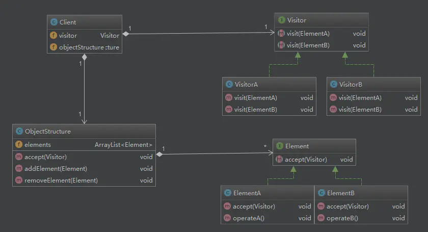

## 行为型模式5

### 访问者模式

Visitor Design Pattern:允许一个或者多个操作应用到一组对象上，解耦操作和对象本身。    
主要是解决继承无法动态进行抽象方法扩展问题.因为继承是纵向扩展方便,只有新增加子类即可,但是横向扩展就需要在父类中增加抽象方法,这样所有的子类都需要调整;    
它是一种将数据操作和数据结构分离的设计模式.

- 使用场景

1 数据结构稳定,但是数据操作需要灵活扩展;    
2 数据操作变动不希望影响已有的行为;



访问者模式UML类图

类说明:

Visitor:访问者(数据行为)接口或抽象类.定义了数据结构(Element)的访问行为,它的参数就是访问者的数据结构;    
VisitorA,B:访问者实现类.定义每个数据结构的具体行为,它的参数就是数据结构的实现类.它是该模式的主要扩展点;    
Element:数据结构接口或抽象类.它定义了一个接收访问者的方法:accept(Visitor).其保证每个数据结构都可以有自己的数据行为(访问行为).访问者模式要求Element的定义稳定,否则就需要频繁的修改所有visitor,就不适合使用该模式.    
ElementA,B:数据结构实现类.用于定义具体的数据结构,这个数据结构就是访问者行为的方法参数.    
ObjectStructure:用于管理对象结构,绑定数据结构与数据行为(visitor可能有多个)的关联.    

它通过分离操作行为和对象的声明,通过抽象操作行为来支持操作行为对于变化的扩展能力.实际上打破了面向对象的封装性.
代码也会变的不太易于理解,可读性和可维护性变差.

核心是利用抽象行为结构+多态+编译时确定重写方法.

#### 示例1 模式演变

需求: 对于不同文本格式的文件进行文本内容提取;比如:PdfFile、PPTFile、WordFile

这里其实对于文本提取操作有隐形的扩展要求,因为文本格式很多,这种扩展性要求基本是必须的.

- version1: 通过抽象父类抽象行为来支持行为扩展

```
public abstract class ResourceFile {
  protected String filePath;
  public ResourceFile(String filePath) {
    this.filePath = filePath;
  }
  public abstract void extract2txt();
}

public class PPTFile extends ResourceFile {
  @Override
  public void extract2txt() { }
}
public class PdfFile extends ResourceFile {
  @Override
  public void extract2txt() { }
}
public class WordFile extends ResourceFile {
  @Override
  public void extract2txt() {}
}

public class ToolApplication {
  public static void main(String[] args) {
    List<ResourceFile> resourceFiles = listAllResourceFiles(args[0]);
    for (ResourceFile resourceFile : resourceFiles) {
      resourceFile.extract2txt();
    }
  }

  private static List<ResourceFile> listAllResourceFiles(String resourceDirectory) {
    List<ResourceFile> resourceFiles = new ArrayList<>();
    //...根据后缀(pdf/ppt/word)由工厂方法创建不同的类对象(PdfFile/PPTFile/WordFile)
    resourceFiles.add(new PdfFile("a.pdf"));
    resourceFiles.add(new WordFile("b.word"));
    resourceFiles.add(new PPTFile("c.ppt"));
    return resourceFiles;
  }
}
```

抽象方法的问题:

1 违背开闭原则.功能扩展只能继续在抽象父类中增加抽象接口,且要修改所有子类;    
2 可读性,可维护性变差.因为功能扩展是预期中的,所以随着功能扩展,代码也会膨胀;    
3 继承会造成耦合.上层的业务逻辑会耦合到子类,导致类的职责不单一.


- 使用访问者模式进行代码改进    
抽取业务行为到单独的类中,按需调用,实现结构声明和行为的解耦
```
public abstract class ResourceFile {
  protected String filePath;
  public ResourceFile(String filePath) {
    this.filePath = filePath;
  }
}
public class PdfFile extends ResourceFile {
  public PdfFile(String filePath) {
    super(filePath);
  }
}
//...PPTFile、WordFile代码省略...
public class Extractor {
  public void extract2txt(PPTFile pptFile) {
    System.out.println("Extract PPT.");
  }

  public void extract2txt(PdfFile pdfFile) {
    System.out.println("Extract PDF.");
  }

  public void extract2txt(WordFile wordFile) {
    System.out.println("Extract WORD.");
  }
}

public class ToolApplication {
  public static void main(String[] args) {
    Extractor extractor = new Extractor();
    List<ResourceFile> resourceFiles = listAllResourceFiles(args[0]);
    for (ResourceFile resourceFile : resourceFiles) {
      // 这里编译时会报错,因为无法没有定义父类的重载方法
      extractor.extract2txt(resourceFile);
    }
  }
  private static List<ResourceFile> listAllResourceFiles(String resourceDirectory) {
    List<ResourceFile> resourceFiles = new ArrayList<>();
    //...根据后缀(pdf/ppt/word)由工厂方法创建不同的类对象(PdfFile/PPTFile/WordFile)
    resourceFiles.add(new PdfFile("a.pdf"));
    resourceFiles.add(new WordFile("b.word"));
    resourceFiles.add(new PPTFile("c.ppt"));
    return resourceFiles;
  }
}
```

上面extractor.extract2txt(resourceFile)会报错原因:多态是一种动态绑定，可以在运行时获取对象的实际类型，来运行实际类型对应的方法。而函数重载是一种静态绑定，在编译时并不能获取对象的实际类型，而是根据声明类型执行声明类型对应的方法.    
同时Extractor中必须声明三个同种结构的方法,因为它的实现方式不同;

上面的问题,可以通过在结构类中增加显示的行为方法调用解决,但是这样又会回到行为耦合的问题:

```
public class PdfFile extends ResourceFile {
  public PdfFile(String filePath) {
    super(filePath);
  }

  @Override
  public void accept(Extractor extractor) {
    // 显示行为调用,解决直接调用编译异常
    extractor.extract2txt(this);
  }
}

public class ToolApplication {
  public static void main(String[] args) {
    Extractor extractor = new Extractor();
    List<ResourceFile> resourceFiles = listAllResourceFiles(args[0]);
    for (ResourceFile resourceFile : resourceFiles) {
      // 通过泛型特性来触发特定的类方法
      resourceFile.accept(extractor);
    }
  }
}
```

但是上面的解决方式依旧存在新增方式大量修改的问题;这种方式适用于,单个类型的方法进行纵向扩展,即只会新增文本类型,这样提取文本的行为就是通用的,这样可以保证结构声明不用修改,实现类方法的扩展.

- 抽象行为来支持横向变化扩展

```
public abstract class ResourceFile {
  protected String filePath;
  public ResourceFile(String filePath) {
    this.filePath = filePath;
  }
  public abstract void accept(Visitor vistor);
}
public class PdfFile extends ResourceFile {
  public PdfFile(String filePath) {
    super(filePath);
  }
  @Override
  public void accept(Visitor visitor) {
    visitor.visit(this);
  }
}
//...PPTFile、WordFile跟PdfFile类似，这里就省略了...

// 访问者模式核心,通过多态抽象行为声明来支持方法参数的动态选择(其实是对于方法参数编译时确定的适配)
public interface Visitor {
  void visit(PdfFile pdfFile);
  void visit(PPTFile pdfFile);
  void visit(WordFile pdfFile);
}

public class Extractor implements Visitor {
  @Override
  public void visit(PPTFile pptFile) {}
  @Override
  public void visit(PdfFile pdfFile) {}
  @Override
  public void visit(WordFile wordFile) {}
}

public class Compressor implements Visitor {
  @Override
  public void visit(PPTFile pptFile) {  }
  @Override
  public void visit(PdfFile pdfFile) {  }
  @Override
  public void visit(WordFile wordFile) {  }
}

public class ToolApplication {
  public static void main(String[] args) {
    Extractor extractor = new Extractor();
    List<ResourceFile> resourceFiles = listAllResourceFiles(args[0]);
    for (ResourceFile resourceFile : resourceFiles) {
      resourceFile.accept(extractor);
    }

    Compressor compressor = new Compressor();
    for(ResourceFile resourceFile : resourceFiles) {
      resourceFile.accept(compressor);
    }
  }

  private static List<ResourceFile> listAllResourceFiles(String resourceDirectory) {
    List<ResourceFile> resourceFiles = new ArrayList<>();
    //...根据后缀(pdf/ppt/word)由工厂方法创建不同的类对象(PdfFile/PPTFile/WordFile)
    resourceFiles.add(new PdfFile("a.pdf"));
    resourceFiles.add(new WordFile("b.word"));
    resourceFiles.add(new PPTFile("c.ppt"));
    return resourceFiles;
  }
}
```

#### 示例2

需求: 年底，CEO和CTO开始评定员工一年的工作绩效，员工分为工程师和经理，CTO关注工程师的代码量、经理的新产品数量；CEO关注的是工程师的KPI和经理的KPI以及新产品数量。
由于CEO和CTO对于不同员工的关注点是不一样的，这就需要对不同员工类型进行不同的处理。访问者模式此时可以派上用场了。

- 正常写法

1 往往将行为直接写到实体定义中,这种是编写最简单,但是扩展性是最差的,因为数据结构稳定,但是数据行为多样,只要数据行为要调整基本所有的数据结构类都需要进行修改;    
2 抽离数据行为到单独的一个类里,进行条件判断,有点类似于策略模式.这种将变化内容隔离到单独的里,这样如果行为修改只需要修改一个类即可.不好的地方是这个类会逐渐变大,然后就是变动可能性很高.可读性会越来越差.    

```
public class ReportUtil {
    public void visit(Staff staff) {
        if (staff instanceof Manager) {
            Manager manager = (Manager) staff;
            System.out.println("经理: " + manager.name + ", KPI: " + manager.kpi +
                    ", 新产品数量: " + manager.getProducts());
        } else if (staff instanceof Engineer) {
            Engineer engineer = (Engineer) staff;
            System.out.println("工程师: " + engineer.name + ", KPI: " + engineer.kpi);
        }
    }
}
```

- 访问者模式的写法

1 定义数据结构

这里一般会抽象出数据结构element类,再定义数据结构实现类;accept方法用于关联数据结构与数据行为visitor.数据结构要求相对稳定.
```
// 数据结构基类
public abstract class Staff {

    public String name;
    public int kpi;// 员工KPI

    public Staff(String name) {
        this.name = name;
        kpi = new Random().nextInt(10);
    }
    // 核心方法，接受Visitor的访问
    public abstract void accept(Visitor visitor);
}

// 工程师
public class Engineer extends Staff {

    public Engineer(String name) {
        super(name);
    }

    @Override
    public void accept(Visitor visitor) {
        visitor.visit(this);
    }
    // 工程师一年的代码数量
    public int getCodeLines() {
        return new Random().nextInt(10 * 10000);
    }
}

// 经理
public class Manager extends Staff {

    public Manager(String name) {
        super(name);
    }

    @Override
    public void accept(Visitor visitor) {
        visitor.visit(this);
    }
    // 一年做的产品数量
    public int getProducts() {
        return new Random().nextInt(10);
    }
}
```
2 定义visitor类

不同的访问者,行为不一样.这里是访问者扩展的关键.重载的 visit 方法会对元素进行不同的操作，而通过注入不同的 Visitor 又可以替换掉访问者的具体实现，使得对元素的操作变得更灵活，可扩展性更高，同时也消除了类型转换、if-else 等“丑陋”的代码。

```
// 行为接口
public interface Visitor {

    // 访问工程师类型
    void visit(Engineer engineer);

    // 访问经理类型
    void visit(Manager manager);
}

// CEO访问者
public class CEOVisitor implements Visitor {
    @Override
    public void visit(Engineer engineer) {
        System.out.println("工程师: " + engineer.name + ", KPI: " + engineer.kpi);
    }

    @Override
    public void visit(Manager manager) {
        System.out.println("经理: " + manager.name + ", KPI: " + manager.kpi +
                ", 新产品数量: " + manager.getProducts());
    }
}

public class CTOVisitor implements Visitor {
    @Override
    public void visit(Engineer engineer) {
        System.out.println("工程师: " + engineer.name + ", 代码行数: " + engineer.getCodeLines());
    }

    @Override
    public void visit(Manager manager) {
        System.out.println("经理: " + manager.name + ", 产品数量: " + manager.getProducts());
    }
}
```

3 关联数据结构和数据行为
```
// 员工业务报表类
public class BusinessReport {

    private List<Staff> mStaffs = new LinkedList<>();

    public BusinessReport() {
        mStaffs.add(new Manager("经理-A"));
        mStaffs.add(new Engineer("工程师-A"));
        mStaffs.add(new Engineer("工程师-B"));
        mStaffs.add(new Engineer("工程师-C"));
        mStaffs.add(new Manager("经理-B"));
        mStaffs.add(new Engineer("工程师-D"));
    }

    /**
     * 为访问者展示报表
     * @param visitor 公司高层，如CEO、CTO
     */
    public void showReport(Visitor visitor) {
        for (Staff staff : mStaffs) {
            staff.accept(visitor);
        }
    }
}
```

4 客户端调用

```
public class Client {

    public static void main(String[] args) {
        // 构建报表
        BusinessReport report = new BusinessReport();
        System.out.println("=========== CEO看报表 ===========");
        report.showReport(new CEOVisitor());
        System.out.println("=========== CTO看报表 ===========");
        report.showReport(new CTOVisitor());
    }
}
// 输出结果
=========== CEO看报表 ===========
经理: 经理-A, KPI: 9, 新产品数量: 0
工程师: 工程师-A, KPI: 6
工程师: 工程师-B, KPI: 6
工程师: 工程师-C, KPI: 8
经理: 经理-B, KPI: 2, 新产品数量: 6
工程师: 工程师-D, KPI: 6
=========== CTO看报表 ===========
经理: 经理-A, 产品数量: 3
工程师: 工程师-A, 代码行数: 62558
工程师: 工程师-B, 代码行数: 92965
工程师: 工程师-C, 代码行数: 58839
经理: 经理-B, 产品数量: 6
工程师: 工程师-D, 代码行数: 53125
```

在上述示例中，Staff 扮演了 Element 角色，而 Engineer 和 Manager 都是 ConcreteElement；CEOVisitor 和 CTOVisitor 都是具体的 Visitor 对象；而 BusinessReport 就是 ObjectStructure；Client就是客户端代码。
访问者模式最大的优点就是增加访问者非常容易，我们从代码中可以看到，如果要增加一个访问者，只要新实现一个 Visitor 接口的类，从而达到数据对象与数据操作相分离的效果。如果不使用访问者模式，而又不想对不同的元素进行不同的操作，那么必定需要使用 if-else 和类型转换，这使得代码难以升级维护。

#### 优缺点

访问者模式的优点。

- 各角色职责分离，符合单一职责原则    
通过UML类图和上面的示例可以看出来，Visitor、ConcreteVisitor、Element 、ObjectStructure，职责单一，各司其责。    
- 具有优秀的扩展性    
如果需要增加新的访问者，增加实现类 ConcreteVisitor 就可以快速扩展。    
- 使得数据结构和作用于结构上的操作解耦，使得操作集合可以独立变化    
员工属性（数据结构）和CEO、CTO访问者（数据操作）的解耦。    
- 灵活性    

访问者模式的缺点。

- 具体元素对访问者公布细节，违反了迪米特原则    
CEO、CTO需要调用具体员工的方法。    
- 具体元素变更时导致修改成本大    
变更员工属性时，多个访问者都要修改。    
- 违反了依赖倒置原则，为了达到“区别对待”而依赖了具体类，没有以来抽象    
访问者 visit 方法中，依赖了具体员工的具体方法。    

#### 问题:上面的示例还可以使用什么模式实现?

访问者模式核心是解决族内相同方法动态访问的问题,策略模式也可以实现类似的功能.实现方式如下:

1 定义策略key和实现子类,根据key的类型进行子类方法调用.    
2 策略的创建使用抽象工厂来支持子类方法的横向扩展;    


#### 双分派语言与访问者模式

双分派语言不需要访问者模式. 

Single Dispatch:单分派语言

  执行哪个对象的方法(对象的判断),根据对象的运行时类型来决定;    
  执行对象的哪个方法(对象方法的判断),根据方法参数的**编译时**类型来决定;

Double Dispatch:双分派语言

  执行哪个对象的方法,根据对象的运行时类型来决定    
  执行对象的哪个方法,根据方法参数的**运行时**类型来决定

Dispatch:即方法的确认.一个对象调用另一个对象的方法，就相当于给它发送一条消息。这条消息起码要包含对象名、方法名、方法参数。    
Single,Double:方法判断的决定因素.Single只跟"对象"的运行时类型有关;Double:对象”和“方法参数”两者的运行时类型有关

具体到编程语言的语法机制，Single Dispatch和Double Dispatch跟多态和函数重载直接相关。当前主流的面向对象编程语言（比如，Java、C++、C#）都只支持Single Dispatch，不支持Double Dispatch。

Java支持多态特性，代码可以在运行时获得对象的实际类型（也就是前面提到的运行时类型），然后根据实际类型决定调用哪个方法。尽管Java支持函数重载，但Java设计的函数重载的语法规则是，并不是在运行时，根据传递进函数的参数的实际类型，来决定调用哪个重载函数，而是在编译时，根据传递进函数的参数的声明类型（也就是前面提到的编译时类型），来决定调用哪个重载函数。也就是说，具体执行哪个对象的哪个方法，只跟对象的运行时类型有关，跟参数的运行时类型无关。所以，Java语言只支持Single Dispatch。

java单分派示例

```
public class ParentClass {
  public void f() {
    System.out.println("I am ParentClass's f().");
  }
}

public class ChildClass extends ParentClass {
  public void f() {
    System.out.println("I am ChildClass's f().");
  }
}

public class SingleDispatchClass {
  public void polymorphismFunction(ParentClass p) {
    p.f();
  }

  public void overloadFunction(ParentClass p) {
    System.out.println("I am overloadFunction(ParentClass p).");
  }

  public void overloadFunction(ChildClass c) {
    System.out.println("I am overloadFunction(ChildClass c).");
  }
}

public class DemoMain {
  public static void main(String[] args) {
    SingleDispatchClass demo = new SingleDispatchClass();
    ParentClass p = new ChildClass();
    demo.polymorphismFunction(p);//执行哪个对象的方法，由对象的实际类型决定
    demo.overloadFunction(p);//执行对象的哪个方法，由参数对象的声明类型决定
  }
}

//代码执行结果:
I am ChildClass's f().
I am overloadFunction(ParentClass p).
```

假设Java语言支持Double Dispatch,那么代码的方法参数就可以动态选择,也就不需要访问者模式了,这也是支持Double Dispatch的语言不需要访问者模式的原因。

```
public abstract class ResourceFile {
  protected String filePath;
  public ResourceFile(String filePath) {
    this.filePath = filePath;
  }
}

public class PdfFile extends ResourceFile {
  public PdfFile(String filePath) {
    super(filePath);
  }
}
public class Extractor {
  public void extract2txt(PPTFile pptFile) { }

  public void extract2txt(PdfFile pdfFile) { }

  public void extract2txt(WordFile wordFile) { }
}

public class ToolApplication {
  public static void main(String[] args) {
    Extractor extractor = new Extractor();
    List<ResourceFile> resourceFiles = listAllResourceFiles(args[0]);
    for (ResourceFile resourceFile : resourceFiles) {
      extractor.extract2txt(resourceFile);
    }
  }
  }
```

双分派语言中由于方法参数是动态选择的,所以这里extractor.extract2txt(resourceFile)就可以正常通过编译,在运行时选择对应的重载方法.所以也就不需要访问者模式的对于重载适配了.

- 策略模式+工厂模式实现方法参数的动态匹配

```
public abstract class ResourceFile {
  protected String filePath;
  public ResourceFile(String filePath) {
    this.filePath = filePath;
  }
  public abstract ResourceFileType getType();
}

public class PdfFile extends ResourceFile {
  public PdfFile(String filePath) {
    super(filePath);
  }

  @Override
  public ResourceFileType getType() {
    return ResourceFileType.PDF;
  }

  //...
}

//...PPTFile/WordFile跟PdfFile代码结构类似，此处省略...

public interface Extractor {
  void extract2txt(ResourceFile resourceFile);
}

public class PdfExtractor implements Extractor {
  @Override
  public void extract2txt(ResourceFile resourceFile) {
    //...
  }
}

//...PPTExtractor/WordExtractor跟PdfExtractor代码结构类似，此处省略...
// 工厂模式定义
public class ExtractorFactory {
  private static final Map<ResourceFileType, Extractor> extractors = new HashMap<>();
  static {
    // 策略模式
    extractors.put(ResourceFileType.PDF, new PdfExtractor());
    extractors.put(ResourceFileType.PPT, new PPTExtractor());
    extractors.put(ResourceFileType.WORD, new WordExtractor());
  }

  public static Extractor getExtractor(ResourceFileType type) {
    return extractors.get(type);
  }
}

public class ToolApplication {
  public static void main(String[] args) {
    List<ResourceFile> resourceFiles = listAllResourceFiles(args[0]);
    for (ResourceFile resourceFile : resourceFiles) {
      Extractor extractor = ExtractorFactory.getExtractor(resourceFile.getType());
      extractor.extract2txt(resourceFile);
    }
  }

  private static List<ResourceFile> listAllResourceFiles(String resourceDirectory) {
    List<ResourceFile> resourceFiles = new ArrayList<>();
    //...根据后缀(pdf/ppt/word)由工厂方法创建不同的类对象(PdfFile/PPTFile/WordFile)
    resourceFiles.add(new PdfFile("a.pdf"));
    resourceFiles.add(new WordFile("b.word"));
    resourceFiles.add(new PPTFile("c.ppt"));
    return resourceFiles;
  }
}
```

- 策略模式和访问者模式的选择

如果工具提供的功能并不是非常多，只有几个而已，那我更推荐使用工厂模式的实现方式，毕竟代码更加清晰、易懂。相反，如果工具提供非常多的功能，比如有十几个，那我更推荐使用访问者模式，因为访问者模式需要定义的类要比工厂模式的实现方式少很多，类太多也会影响到代码的可维护性。

#### 问题 

- 访问者模式是否破坏的了面向对象.

是的.因为它破坏了对象的声明的统一性.但是它通过聚合行为来实现行为的扩展性,是一种扩展性的折衷方案.

- 下面示例会输出什么,为什么

```
    public void overloadFunction(Parent p) {
        p.f();
    }

    public void overloadFunction(Child c) {
        c.f();
    }

    main{
      Parent p = new Child();
        demo.overloadFunction(p);//执行对象的哪个方法，由参数对象的声明类型决定
    }
```
输出结果:

  I am ChildClass's f().  

因为无论是单分派还是双分派,哪个类的方法执行是在运行时决定的,所以会触发child.f()方法


#### 参考资料

[访问者模式一篇就够了](https://www.jianshu.com/p/1f1049d0a0f4)


