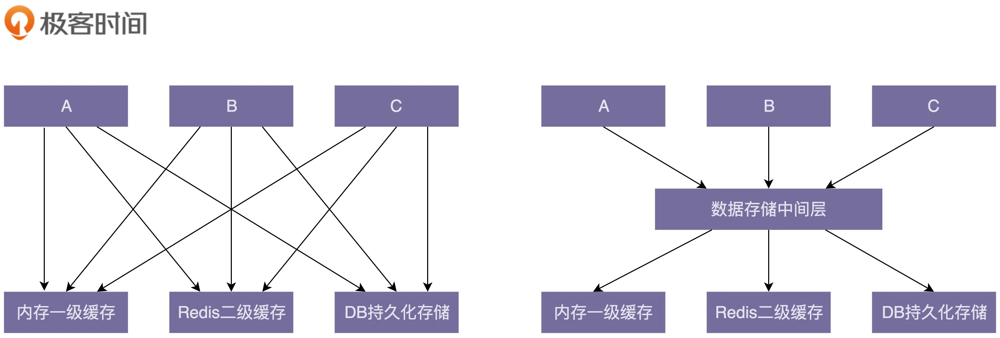

## 重构

重构:**需要分析代码存在的问题或设计上的不足,并能够合理,熟练的利用设计思想,原则,模式,编程规范等理论知识解决这些问题.**


### 重构的价值:

在保持功能不变的前提下，利用设计思想、原则、模式、编程规范等理论来优化代码，修改设计上的不足，提高代码质量。重构可以保持代码质量持续处于一个可控状态.

### 重构内容

大型重构指的是对顶层代码设计的重构，包括：系统、模块、代码结构、类与类之间的关系等的重构，重构的手段有：分层、模块化、解耦、抽象可复用组件等等。这类重构的工具就是我们学习过的那些设计思想、原则和模式。这类重构涉及的代码改动会比较多，影响面会比较大，所以难度也较大，耗时会比较长，引入 bug 的风险也会相对比较大。

小型重构指的是对代码细节的重构，主要是针对类、函数、变量等代码级别的重构，比如规范命名、规范注释、消除超大类或函数、提取重复代码等等。小型重构更多的是利用我们能后面要讲到的编码规范。

### 如何重构

大型重构的时候，我们要提前做好完善的重构计划，有条不紊地分阶段来进行。每个阶段完成一小部分代码的重构，然后提交、测试、运行，发现没有问题之后，再继续进行下一阶段的重构，保证代码仓库中的代码一直处于可运行、逻辑正确的状态。每个阶段，我们都要控制好重构影响到的代码范围，考虑好如何兼容老的代码逻辑，必要的时候还需要写一些兼容过渡代码。只有这样，我们才能让每一阶段的重构都不至于耗时太长（最好一天就能完成），不至于与新的功能开发相冲突。

除了人工去发现低层次的质量问题，我们还可以借助很多成熟的静态代码分析工具（比如 CheckStyle、FindBugs、PMD），来自动发现代码中的问题，然后针对性地进行重构优化

1. 理解代码含义,理解里面的需求.梳理出流程图;
2. 建立防护网.将需求拆分后,针对拆分的业务点写单元测试;
3. 开始重构,解耦逻辑,将方法职责单一.类与类见最小依赖原则(迪米特原则);命名要规范;职责清晰;
4. 进行单元测试功能验证.

实际重构其实不断尝试和梳理现有流程,当流程可控时,代码质量也会提高;

### 单元测试

如果要进行代码重构,单元测试验证重构代码是否满足需求的强有力保障.

集成测试的测试对象是整个系统或者某个功能模块，比如测试用户注册、登录功能是否正常，是一种端到端（end to end）的测试。而单元测试的测试对象是类或者函数，用来测试一个类和函数是否都按照预期的逻辑执行。这是代码层级的测试。

单元测试更多的是考验程序员思维的缜密程度，看能否设计出覆盖各种正常及异常情况的测试用例，来保证代码在任何预期或非预期的情况下都能正确运行。

```

public class Text {
  private String content;

  public Text(String content) {
    this.content = content;
  }

  /**
   * 将字符串转化成数字，忽略字符串中的首尾空格；
   * 如果字符串中包含除首尾空格之外的非数字字符，则返回null。
   */
  public Integer toNumber() {
    if (content == null || content.isEmpty()) {
      return null;
    }
    //...省略代码实现...
    return null;
  }
}
```

单元测试的测试示例:

```
如果字符串只包含数字：“123”，toNumber() 函数输出对应的整数：123。    
如果字符串是空或者 null，toNumber() 函数返回：null。    
如果字符串包含首尾空格：“ 123”，“123 ”，“ 123 ”，toNumber() 返回对应的整数：123。    
如果字符串包含多个首尾空格：“ 123 ”，toNumber() 返回对应的整数：123；    
如果字符串包含非数字字符：“123a4”，“123 4”，toNumber() 返回 null；
```

- 单元测试的价值

1 单元测试能有效地帮你发现代码中的 bug 

思路梳理,功能验证,涵盖范围更全面;

2 写单元测试能帮你发现代码设计上的问题

代码的可测试性是评判代码质量的一个重要标准。对于一段代码，如果很难为其编写单元测试，或者单元测试写起来很吃力，需要依靠单元测试框架里很高级的特性才能完成，那往往就意味着代码设计得不够合理，比如，没有使用依赖注入、大量使用静态函数、全局变量、代码高度耦合等。

3 单元测试是对集成测试的有力补充

集成是功能可衔接;但是边界情形无法覆盖到位;

4 写单元测试的过程本身就是代码重构的过程

设计和实现代码的时候，我们很难把所有的问题都想清楚。而编写单元测试就相当于对代码的一次自我 Code Review，在这个过程中，我们可以发现一些设计上的问题（比如代码设计的不可测试）以及代码编写方面的问题（比如一些边界条件处理不当）等，然后针对性的进行重构。

5 阅读单元测试能帮助你快速熟悉代码

便于维护.单元测试用例实际上就是用户用例，反映了代码的功能和如何使用。借助单元测试，我们不需要深入的阅读代码，便能知道代码实现了什么功能，有哪些特殊情况需要考虑，有哪些边界条件需要处理。

- 单元测试编写原则

写单元测试就是针对代码设计各种测试用例，以覆盖各种输入、异常、边界情况，并将其翻译成代码。我们可以利用一些测试框架来简化单元测试的编写。除此之外，对于单元测试，我们需要建立以下正确的认知：

    编写单元测试尽管繁琐，但并不是太耗时；    
    我们可以稍微放低对单元测试代码质量的要求；    
    覆盖率作为衡量单元测试质量的唯一标准是不合理的；    
    单元测试不要依赖被测代码的具体实现逻辑,它只关心被测函数实现了什么功能；    
    单元测试框架无法测试，多半是因为代码的可测试性不好。

单元测试的编写可以衡量重要性和编写成本后实施,针对复杂易出错的地方编写完善的单元测试.

### 代码的可测试性

代码的可测试性:针对代码编写单元测试的难易程度.如果很难测试则意味代码设计不合理.

- 提高可测试性方式

1 封装    
2 依赖注入    
3 核心是尽量屏蔽不确定因素,可控才是可测试,明确的代码

示例:

Transaction 是经过我抽象简化之后的一个电商系统的交易类，用来记录每笔订单交易的情况。Transaction 类中的 execute() 函数负责执行转账操作，将钱从买家的钱包转到卖家的钱包中。真正的转账操作是通过调用 WalletRpcService RPC 服务来完成的。除此之外，代码中还涉及一个分布式锁 DistributedLock 单例类，用来避免 Transaction 并发执行，导致用户的钱被重复转出。

```

public class Transaction {
  private String id;
  private Long buyerId;
  private Long sellerId;
  private Long productId;
  private String orderId;
  private Long createTimestamp;
  private Double amount;
  private STATUS status;
  private String walletTransactionId;
  
  // ...get() methods...
  
  // 问题1 构造函数参数太多,且存在业务逻辑操作
  public Transaction(String preAssignedId, Long buyerId, Long sellerId, Long productId, String orderId) {
    if (preAssignedId != null && !preAssignedId.isEmpty()) {
      this.id = preAssignedId;
    } else {
      this.id = IdGenerator.generateTransactionId();
    }
    if (!this.id.startWith("t_")) {
      this.id = "t_" + preAssignedId;
    }
    this.buyerId = buyerId;
    this.sellerId = sellerId;
    this.productId = productId;
    this.orderId = orderId;
    this.status = STATUS.TO_BE_EXECUTD;
    this.createTimestamp = System.currentTimestamp();
  }
  
  public boolean execute() throws InvalidTransactionException {
    if ((buyerId == null || (sellerId == null || amount < 0.0) {
      throw new InvalidTransactionException(...);
    }
    if (status == STATUS.EXECUTED) return true;
    boolean isLocked = false;
    try {
        // 问题2 直接依赖外部资源,不利于测试
      isLocked = RedisDistributedLock.getSingletonIntance().lockTransction(id);
      if (!isLocked) {
        return false; // 锁定未成功，返回false，job兜底执行
      }
      if (status == STATUS.EXECUTED) return true; // double check
      long executionInvokedTimestamp = System.currentTimestamp();
      // 问题3 过期时间是未决条件,不利于测试
      if (executionInvokedTimestamp - createdTimestap > 14days) {
        this.status = STATUS.EXPIRED;
        return false;
      }
      // 问题4 直接new,强依赖实现,且声明周期耦合;同时依赖外部资源,不利于测试
      WalletRpcService walletRpcService = new WalletRpcService();
      String walletTransactionId = walletRpcService.moveMoney(id, buyerId, sellerId, amount);
      if (walletTransactionId != null) {
        this.walletTransactionId = walletTransactionId;
        this.status = STATUS.EXECUTED;
        return true;
      } else {
        this.status = STATUS.FAILED;
        return false;
      }
    } finally {
      if (isLocked) {
       RedisDistributedLock.getSingletonIntance().unlockTransction(id);
      }
    }
  }
}
```

针对这个函数，我设计了下面 6 个测试用例。

1 正常情况下，交易执行成功，回填用于对账（交易与钱包的交易流水）用的 walletTransactionId，交易状态设置为 EXECUTED，函数返回 true。    
2 buyerId、sellerId 为 null、amount 小于 0，返回 InvalidTransactionException。    
3 交易已过期（createTimestamp 超过 14 天），交易状态设置为 EXPIRED，返回 false。    
4 交易已经执行了（status==EXECUTED），不再重复执行转钱逻辑，返回 true。    
5 钱包（WalletRpcService）转钱失败，交易状态设置为 FAILED，函数返回 false。    
6 交易正在执行着，不会被重复执行，函数直接返回 false。

问题:

- execute() 函数的执行依赖两个外部的服务，一个是 RedisDistributedLock，一个 WalletRpcService。可能出现如下状况:

如果要让这个单元测试能够运行，我们需要搭建 Redis 服务和 Wallet RPC 服务。搭建和维护的成本比较高。    
我们还需要保证将伪造的 transaction 数据发送给 Wallet RPC 服务之后，能够正确返回我们期望的结果，然而 Wallet RPC 服务有可能是第三方（另一个团队开发维护的）的服务，并不是我们可控的。换句话说，并不是我们想让它返回什么数据就返回什么。    
Transaction 的执行跟 Redis、RPC 服务通信，需要走网络，耗时可能会比较长，对单元测试本身的执行性能也会有影响。    
网络的中断、超时、Redis、RPC 服务的不可用，都会影响单元测试的执行。

单元测试主要是测试程序员自己编写的代码逻辑的正确性，并非是端到端的集成测试，它不需要测试所依赖的外部系统（分布式锁、Wallet RPC 服务）的逻辑正确性。所以，如果代码中依赖了外部系统或者不可控组件，比如，需要依赖数据库、网络通信、文件系统等，那我们就需要将被测代码与外部系统解依赖，而这种解依赖的方法就叫作“mock”。所谓的 mock 就是用一个“假”的服务替换真正的服务。mock 的服务完全在我们的控制之下，模拟输出我们想要的数据。

我们通过继承 WalletRpcService 类，并且重写其中的 moveMoney() 函数的方式来实现 mock。具体的代码实现如下所示。通过 mock 的方式，我们可以让 moveMoney() 返回任意我们想要的数据，完全在我们的控制范围内，并且不需要真正进行网络通信。

```

public class MockWalletRpcServiceOne extends WalletRpcService {
  public String moveMoney(Long id, Long fromUserId, Long toUserId, Double amount) {
    return "123bac";
  } 
}

public class MockWalletRpcServiceTwo extends WalletRpcService {
  public String moveMoney(Long id, Long fromUserId, Long toUserId, Double amount) {
    return null;
  } 
}
```

- 同时通过依赖注入的方式引入WalletRpcService类,避免直接依赖实现类;

- RedisDistributedLock抽象

因为 RedisDistributedLock 是一个单例类。单例相当于一个全局变量，我们无法 mock（无法继承和重写方法），也无法通过依赖注入的方式来替换。我们可以抽象出Lock行为,通过接口或者方法的方式来提供该功能.

```

public class TransactionLock {
  public boolean lock(String id) {
    return RedisDistributedLock.getSingletonIntance().lockTransction(id);
  }
  
  public void unlock() {
    RedisDistributedLock.getSingletonIntance().unlockTransction(id);
  }
}

public class Transaction {
  //...
  private TransactionLock lock;
  
  public void setTransactionLock(TransactionLock lock) {
    this.lock = lock;
  }
 
  public boolean execute() {
    //...
    try {
      isLocked = lock.lock();
      //...
    } finally {
      if (isLocked) {
        lock.unlock();
      }
    }
    //...
  }
}
```

- 封装"未决行为"

交易已过期（createTimestamp 超过 14 天），交易状态设置为 EXPIRED，返回 false.这个需要维护createTimestamp的取值,如果直接将setCreateTimestamp对外暴露,带来了不可控性.好的方式是将是否过期封装成isExpired()函数.

```

public class Transaction {

  protected boolean isExpired() {
    long executionInvokedTimestamp = System.currentTimestamp();
    return executionInvokedTimestamp - createdTimestamp > 14days;
  }
  
  public boolean execute() throws InvalidTransactionException {
    //...
      if (isExpired()) {
        this.status = STATUS.EXPIRED;
        return false;
      }
    //...
  }
}
```

- 场景的测试不友好代码(Anti-Patterns)

1 未决行为:存在代码输出随机或不确定的功能    
2 全局变量:变量就要不确定的前置状态,会影响测试的准确性;    
3 静态方法:有在这个静态方法执行耗时太长、依赖外部资源、逻辑复杂、行为未决等情况下，我们才需要在单元测试中 mock 这个静态方法    
4 复杂继承:继承关系的代码结构更加耦合、不灵活，更加不易扩展、不易维护。实际上，继承关系存在隐藏的前置条件,会直接影响测试的准确度;    
5 高耦合代码:外部依赖多,无法或者很难覆盖测试条件;    


### 解耦

解耦是为了屏蔽复杂性.通过压缩(控制)代码范围,关注点更具体,影响范围也可控,可以提高可读性,可维护性,实现高内聚,低耦合.

代码结构清晰、分层和模块化合理、依赖关系简单、模块或类之间的耦合小，那代码整体的质量就不会差.对外影响也较小;

- 如何判断耦合

梳理模块与模块,类与类的依赖关系图,如果关系复杂,混乱,则可判断为耦合强.

- 如何解耦

1 封装与抽象.通过约束代码范围,以及抽取概念,可以避免直接引用,限制代码的影响范围;    
2 中间层.增加隔离,简化复杂依赖关系;    
    

新旧接口通过中间层进行过渡:    

    第一阶段：引入一个中间层，包裹老的接口，提供新的接口定义。    
    第二阶段：新开发的代码依赖中间层提供的新接口。    
    第三阶段：将依赖老接口的代码改为调用新接口。    
    第四阶段：确保所有的代码都调用新接口之后，删除掉老的接口。

3 模块化.复杂系统的核心就是分工与模块化拆分.这时模块化的拆分,通信,及如何组合工作就是另外一个考验人能力的地方    
4 单一职责原则:模块或者类的职责设计得单一，而不是大而全，那依赖它的类和它依赖的类就会比较少，代码耦合也就相应的降低     
5 基于接口而非实现编程:接口就是中间层    
6 依赖注入:避免依赖具体实现,生命周期的解耦    
7 多用组合少用继承:继承的父类改动,会直接影响子类    
8 迪米特法则:最小依赖原则.    

AOP:业务代码与非业务代码的解耦    
IOC:创建者与使用者的解耦    


